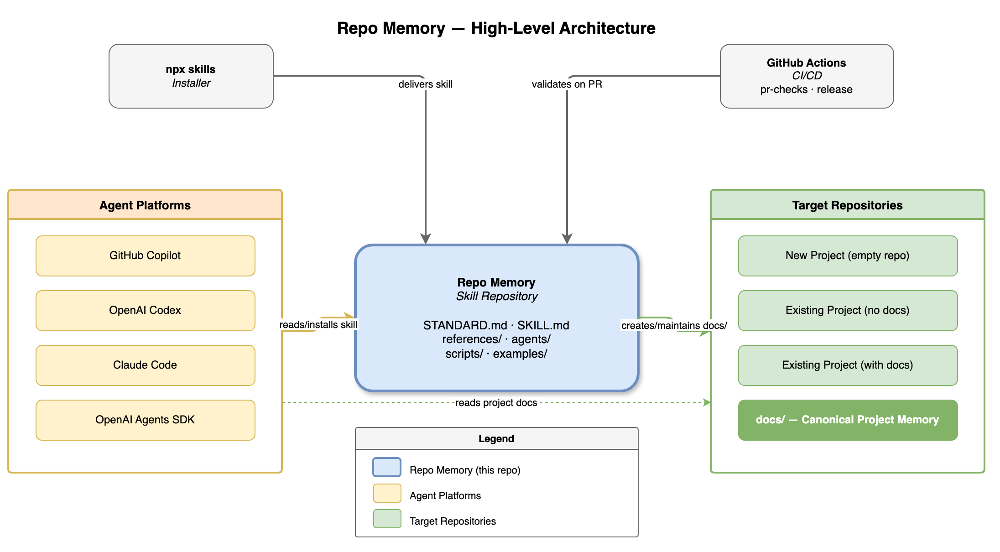
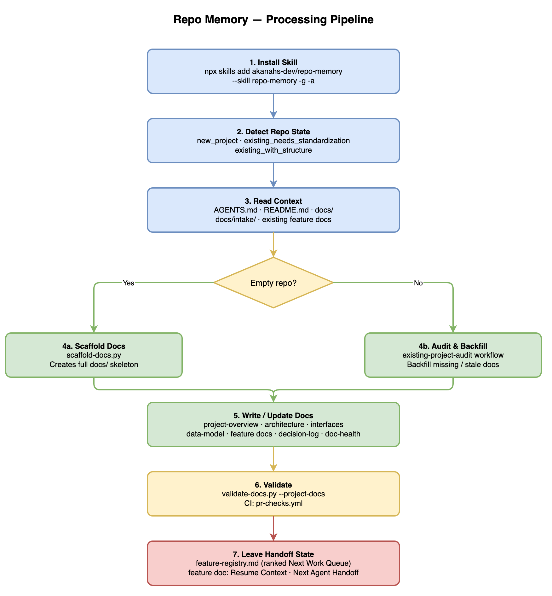
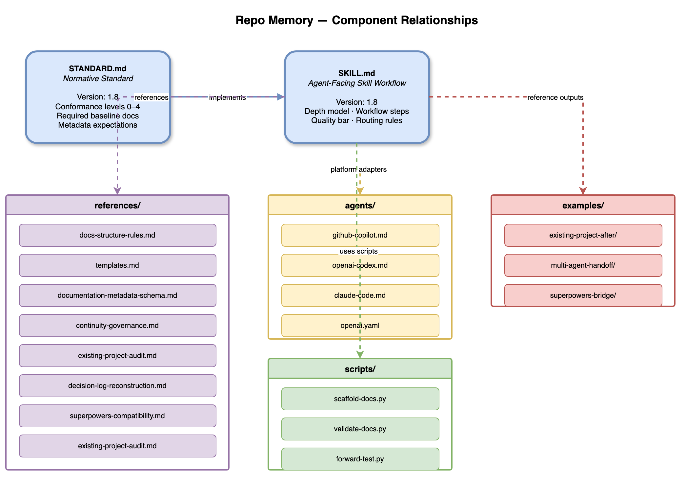

# Repo Memory — Project Summary

## 1. Executive Summary

Repo Memory is a portable, repo-native project memory and handoff standard for AI-assisted software projects. It defines a structured set of Markdown documentation files, metadata conventions, status values, and evidence rules that help humans and coding agents understand, resume, and safely change any software project from shared repository docs. The skill is installed via `npx skills add` and works with GitHub Copilot, OpenAI Codex, Claude Code, and the OpenAI Agents SDK. Repo Memory keeps project context — architecture, requirements, decisions, feature state, and handoff notes — close to the code rather than locked in chat history or one-tool memory. At version 1.8, the standard supports four conformance levels (Baseline through Integrated), a ranked next-work queue for autonomous cloud agents, intake-to-canonical promotion for raw brainstorms, and full continuity governance including provenance, conflict resolution, and multi-agent handoff protocols.

---

## 2. Architecture Overview



Repo Memory sits at the centre of a three-party relationship:

| Party                       | Role                                                                                                                                                                                   |
| --------------------------- | -------------------------------------------------------------------------------------------------------------------------------------------------------------------------------------- |
| **Repo Memory (this repo)** | Provides the portable standard (`STANDARD.md`), the agent-facing skill workflow (`SKILL.md`), reference docs, platform adapters, Python utility scripts, and adoption examples.        |
| **Agent Platforms**         | GitHub Copilot, OpenAI Codex, Claude Code, and the OpenAI Agents SDK install the skill via `npx skills add` and use its workflow to create or maintain `docs/` in target repositories. |
| **Target Repositories**     | Any software project that adopts the standard. Agents apply the skill to scaffold, audit, and maintain a `docs/` tree in the target repo.                                              |

The `npx skills` installer delivers the skill package to agent tool directories. GitHub Actions CI (`pr-checks.yml`, `release.yml`) validates the skill repo itself — checking Markdown lint, relative links, doc-structure rules, `SKILL.md` version format, and changelog alignment on every pull request.

Agent platforms consume the skill definition and read project docs from the target repo. Once docs exist, agents read them on every session start so they can orient, resume, and hand off without relying on chat history.

---

## 3. Processing Pipeline



When an agent applies the Repo Memory skill to a target repository, it follows a seven-step pipeline:

| Step                                     | Action                                                                                                                                                                       | Key Artefacts                             |
| ---------------------------------------- | ---------------------------------------------------------------------------------------------------------------------------------------------------------------------------- | ----------------------------------------- |
| **1. Install Skill**                     | `npx skills add akanahs-dev/repo-memory --skill repo-memory -g -a <agent>` installs the skill payload globally or per-project.                                               | Installed `skills/repo-memory/` directory |
| **2. Detect Repo State**                 | The agent classifies the repo as `new_project`, `existing_project_needs_standardization`, or `existing_project_with_structure`.                                              | Classification decision                   |
| **3. Read Context**                      | Reads `AGENTS.md`, `README.md`, `.github/copilot-instructions.md`, `docs/`, and `docs/intake/` raw brainstorms.                                                              | Source evidence inventory                 |
| **4a. Scaffold (empty repo)**            | Runs `scaffold-docs.py` to create the complete `docs/` skeleton including `docs/intake/README.md` for raw brainstorm capture.                                                | Full `docs/` tree                         |
| **4b. Audit & Backfill (existing repo)** | Follows `existing-project-audit.md` to identify missing or stale baseline docs and backfill them from code evidence.                                                         | Gap analysis + filled docs                |
| **5. Write / Update Docs**               | Creates or refreshes the standard doc set: project overview, architecture, interfaces, data model, feature registry, decision log, implementation log, doc health, and more. | 15+ canonical Markdown docs               |
| **6. Validate**                          | Runs `validate-docs.py --project-docs <repo>` locally; CI enforces Markdown lint, relative-link checks, structure rules, and version validation.                             | Validation report                         |
| **7. Leave Handoff State**               | Updates `feature-registry.md` (ranked `Next Work Queue`), active feature doc (`Resume Context`, `Next Agent Handoff`), and `doc-health.md`.                                  | Resumable session artefacts               |

---

## 4. Core Components



The Repo Memory skill package lives in `skills/repo-memory/` and contains four functional groups:

### 4.1 Normative Documents

| File          | Purpose                                                                                                                                                                                                                               |
| ------------- | ------------------------------------------------------------------------------------------------------------------------------------------------------------------------------------------------------------------------------------- |
| `STANDARD.md` | Portable Repo Memory standard: conformance levels 0–4, required baseline docs, metadata expectations, and non-goals. This is the normative entrypoint.                                                                                |
| `SKILL.md`    | Agent-facing implementation of the standard. Defines the workflow, depth model, quality bar, and routing rules for how agents apply the standard. Version-tracked; every change must bump the version and add a `CHANGELOG.md` entry. |

`SKILL.md` implements `STANDARD.md`. The two files share the same `Version:` number (currently `1.8`).

### 4.2 Reference Documents (`references/`)

| File                               | Purpose                                                                                                            |
| ---------------------------------- | ------------------------------------------------------------------------------------------------------------------ |
| `docs-structure-rules.md`          | Strict kebab-case naming rules, placement rules, and enforcement checklist.                                        |
| `templates.md`                     | Copy-paste templates for every standard doc type, each with a usage note.                                          |
| `documentation-metadata-schema.md` | Standard metadata fields, required fields by doc type, allowed status values, and examples.                        |
| `continuity-governance.md`         | Freshness protocols, conflict resolution, rename procedures, feature closure, and multi-agent coordination rules.  |
| `existing-project-audit.md`        | Step-by-step audit workflow for backfilling docs in repos that already have code.                                  |
| `decision-log-reconstruction.md`   | Comprehensive guidance for reconstructing durable technical decisions from code evidence and project history.      |
| `superpowers-compatibility.md`     | Bridge guidance for linking Obra Superpowers specs/plans as evidence without replacing canonical Repo Memory docs. |

### 4.3 Platform Adapters (`agents/`)

| File                | Target Platform                                                                                       |
| ------------------- | ----------------------------------------------------------------------------------------------------- |
| `github-copilot.md` | GitHub Copilot Coding Agent — session workflow, instruction-file alignment, CI integration tips.      |
| `openai-codex.md`   | OpenAI Codex — skill activation, workflow routing, and session-end checklist.                         |
| `claude-code.md`    | Claude Code — context window strategy, file-reading order, and handoff conventions.                   |
| `openai.yaml`       | OpenAI Agents SDK — `interface` block with `display_name`, `short_description`, and `default_prompt`. |

Adapters are intentionally thin. They describe how a specific agent should use the standard, not what the standard says. Durable project facts live in `docs/`, not in adapter files.

### 4.4 Python Utility Scripts (`scripts/`)

| Script             | Purpose                                                                                                                                                                                |
| ------------------ | -------------------------------------------------------------------------------------------------------------------------------------------------------------------------------------- |
| `scaffold-docs.py` | Creates the full `docs/` skeleton in an empty or nearly-empty repo. Supports `--with-agents` (generates `AGENTS.md`), `--project-name`, `--include-user-stories`, and `--force`.       |
| `validate-docs.py` | Lightweight local and CI validator. Checks required files, naming rules, metadata fields, feature registry structure, and orphaned docs. Add `--strict` to treat warnings as failures. |
| `forward-test.py`  | Manual blind forward-testing harness. Creates disposable fixture repositories for skill behaviour testing. Supports `--fixture-only` (no live agent), `--scenario`, and `--keep`.      |

### 4.5 Examples (`examples/`)

| Directory                 | What It Shows                                                                                                                                                   |
| ------------------------- | --------------------------------------------------------------------------------------------------------------------------------------------------------------- |
| `existing-project-after/` | A compact target repo after adopting the standard, including all baseline docs, a feature registry with a ranked `Next Work Queue`, and an example feature doc. |
| `multi-agent-handoff/`    | How one agent leaves `Resume Context` and `Next Agent Handoff` state that lets another agent continue without chat history.                                     |
| `superpowers-bridge/`     | Linking `docs/superpowers/specs/` and `docs/superpowers/plans/` artifacts as evidence while keeping canonical handoff in Repo Memory docs.                      |

---

## 5. API Contracts and Document Schema

### 5.1 Required Baseline Docs

Every target repo adopting the standard must keep these files under `docs/`:

| File                                               | Doc Type           | Description                                                             |
| -------------------------------------------------- | ------------------ | ----------------------------------------------------------------------- |
| `docs/README.md`                                   | index              | Documentation map and agent startup order.                              |
| `docs/project-overview.md`                         | project-overview   | Goal, problem, users, success criteria, scope, and non-goals.           |
| `docs/architecture.md`                             | architecture       | System shape, components, data flow, key design decisions.              |
| `docs/interfaces-and-contracts.md`                 | interfaces         | Public interfaces, contracts, APIs, and integration points.             |
| `docs/data-model.md`                               | data-model         | Entities, relationships, ownership, and storage decisions.              |
| `docs/local-development.md`                        | local-development  | Setup, scripts, tooling, codegen, fixtures, contributor workflows.      |
| `docs/doc-health.md`                               | doc-health         | Freshness, verification state, known drift, conflicts, renames.         |
| `docs/observability-and-instrumentation.md`        | observability      | Logs, metrics, traces, analytics, audit events, dashboards, alerts.     |
| `docs/testing-strategy.md`                         | testing-strategy   | Test approach, coverage expectations, test types, and gaps.             |
| `docs/operations-runbook.md`                       | operations-runbook | Deployment, incident response, and operational procedures.              |
| `docs/security-and-privacy.md`                     | security           | Threat model, data handling, auth, secrets management.                  |
| `docs/decision-log.md`                             | decision-log       | Lasting technical choices from project start to current state.          |
| `docs/implementation-log.md`                       | implementation-log | What actually landed, when, and by whom.                                |
| `docs/feature-registry.md`                         | feature-registry   | Feature status table + ranked `Next Work Queue`.                        |
| `docs/requirements/functional-requirements.md`     | requirements       | Functional behaviour the system must implement.                         |
| `docs/requirements/non-functional-requirements.md` | requirements       | Performance, reliability, scalability, and maintainability constraints. |

### 5.2 Standard Metadata Fields

Every canonical doc must include these metadata fields at the top:

| Field              | Allowed Values                                                      | Notes                                                                  |
| ------------------ | ------------------------------------------------------------------- | ---------------------------------------------------------------------- |
| `Doc type`         | `project-overview`, `architecture`, `feature`, `decision-log`, etc. | Matches the doc-type vocabulary in `documentation-metadata-schema.md`. |
| `Owner`            | Agent handle or team name                                           | Who is responsible for keeping this doc current.                       |
| `Status`           | `draft`, `active`, `verified`, `stale`, `superseded`                | Current reliability of the doc's content.                              |
| `Last updated`     | ISO date                                                            | When the doc was last changed.                                         |
| `Last verified`    | ISO date or `unknown`                                               | When the doc was last checked against code.                            |
| `Confidence`       | `low`, `medium`, `high`                                             | How trustworthy the content is relative to code truth.                 |
| `Canonical source` | File path                                                           | The single authoritative location for this information.                |
| `Related docs`     | Comma-separated file paths                                          | Linked artefacts that depend on or complement this doc.                |

### 5.3 Feature Registry Queue Schema

`feature-registry.md` contains a ranked `Next Work Queue` table:

| Column        | Description                                                   |
| ------------- | ------------------------------------------------------------- |
| `Rank`        | Numeric priority — lower is higher priority.                  |
| `Feature`     | Human-readable feature name.                                  |
| `Status`      | `ready`, `verify-first`, `needs-human`, `blocked`.            |
| `Pickup note` | One-line instruction for the next agent picking up this task. |

---

## 6. Infrastructure and Deployment

### 6.1 Repository Structure

This repository follows the common multi-skill layout:

```text
repo-memory/
├── README.md                          # overview and quick-start guide
├── AGENTS.md                          # AI agent instructions
├── CHANGELOG.md                       # version history
├── LICENSE                            # MIT license
├── CONTRIBUTING.md                    # contribution guidelines
├── CODE_OF_CONDUCT.md                 # community behaviour expectations
├── SUPPORT.md                         # support and issue guidance
├── ROADMAP.md                         # directional project roadmap
├── .gitignore                         # local generated-file ignores
├── .gitattributes                     # source archive export rules
├── .markdownlint.json                 # Markdown lint configuration
├── .github/
│   ├── ISSUE_TEMPLATE/                # bug, feature, docs-adoption templates
│   ├── pull_request_template.md       # PR checklist
│   └── workflows/
│       ├── pr-checks.yml              # lint, link-check, validate, version-check on PRs
│       └── release.yml                # auto-tag and GitHub Release on main
└── skills/
    └── repo-memory/                   # installable skill payload
        ├── SKILL.md
        ├── STANDARD.md
        ├── LICENSE.txt
        ├── agents/
        ├── examples/
        ├── scripts/
        └── references/
```

### 6.2 CI/CD Workflows

| Workflow        | Trigger                | Checks                                                                                                                                                                   |
| --------------- | ---------------------- | ------------------------------------------------------------------------------------------------------------------------------------------------------------------------ |
| `pr-checks.yml` | Pull request to `main` | Markdown lint (`markdownlint-cli2`), relative-link validation (Python), `validate-docs.py --skill-repo .`, SKILL.md version format + bump check, CHANGELOG.md alignment. |
| `release.yml`   | Push to `main`         | Auto-tag `vMAJOR.MINOR` and publish a GitHub Release; release body pulled from `CHANGELOG.md`.                                                                           |

### 6.3 Versioning

The standard and skill share the same two-number version (`MAJOR.MINOR`):

| Change type                                              | Action                  |
| -------------------------------------------------------- | ----------------------- |
| New content or non-breaking additions                    | Increment minor version |
| Required baseline changes or structural workflow changes | Increment major version |

The CI version-check enforces that `SKILL.md` version strictly increases on every PR that modifies the file, and that `CHANGELOG.md` contains a matching `## [X.Y]` entry.

### 6.4 Installation

```bash
# Install globally for a specific agent
npx skills add akanahs-dev/repo-memory --skill repo-memory -g -a codex -y

# Install from the skill subfolder directly
npx skills add https://github.com/akanahs-dev/repo-memory/tree/main/skills/repo-memory -g -a codex -y

# Scaffold an empty target repo
python3 skills/repo-memory/scripts/scaffold-docs.py /path/to/repo --with-agents

# Validate a target repo
python3 skills/repo-memory/scripts/validate-docs.py --project-docs /path/to/repo

# Validate this skill repo
python3 skills/repo-memory/scripts/validate-docs.py --skill-repo .
```

---

## 7. Extension Patterns

### Adding a New Reference Document

1. Create the file in `skills/repo-memory/references/` using kebab-case naming (`my-topic.md`).
2. Add standard metadata at the top of the file (doc type, owner, status, dates, confidence, canonical source, related docs).
3. Link the new file from `README.md` (under "Related Docs") and from this `AGENTS.md` (under "Entry Points").
4. Add a template block for the new doc type to `skills/repo-memory/references/templates.md` with a usage note.
5. Update `validate-docs.py` if the new doc type should be required or checked.
6. Bump `SKILL.md` minor version and add a `CHANGELOG.md` entry.

### Adding a New Platform Adapter

1. Create `skills/repo-memory/agents/<platform>.md` (or `.yaml` for SDK configs).
2. Add a comment or front-matter describing the target platform and usage.
3. Keep the adapter thin — describe how the agent uses the standard; do not duplicate durable project facts.
4. Add a row to the Agent-Specific Guides table in `AGENTS.md`.
5. Link it from `README.md`.

### Adding a New Example

1. Create a directory under `skills/repo-memory/examples/<example-slug>/`.
2. Populate it with realistic doc artefacts that demonstrate the specific pattern.
3. Add a description to `skills/repo-memory/examples/README.md`.
4. Link from `README.md` under "Examples".

### Extending scaffold-docs.py

1. Open `skills/repo-memory/scripts/scaffold-docs.py`.
2. Add a new `ScaffoldFile` entry to the `files` list with the file path and content.
3. Document the new scaffold output in `README.md` under "Empty Repository Scaffold".

---

## 8. Rules and Anti-Patterns

### Do

- **One docs layer per project.** Avoid overlapping documentation systems when one maintained `docs/` tree is sufficient.
- **Markdown first.** All docs are plain Markdown — readable without any specific AI provider, editor, or plugin.
- **Evidence before assumption.** Document confirmed facts before inferred ones; mark inferences clearly with low confidence.
- **Keep handoff current.** Always close a session with updated `Resume Context` and `Next Agent Handoff` in the active feature doc.
- **Promote intake before building.** Accept raw brainstorms in `docs/intake/`, then promote accepted facts into canonical docs before depending on them.
- **Increment the version.** Every change to `SKILL.md` must bump the version number and add a `CHANGELOG.md` entry.

### Do Not

- **Do not let `AGENTS.md` become a second source of truth** for mutable project facts. Keep agent instruction files concise and pointing into `docs/`.
- **Do not create empty optional deep-dive folders** just to fill out the docs tree. Create `docs/diagrams/`, `docs/designs/`, etc., only when there is real content.
- **Do not orphan deep-dive docs.** Every deep-dive doc must be linked from an owning baseline doc, feature doc, or index file.
- **Do not skip metadata.** Every canonical doc needs doc type, owner, status, dates, confidence, and related docs.
- **Do not leave resume state in chat history.** Put resumable state in `docs/features/<feature-slug>.md` and linked docs.
- **Do not change a slug after registration** without updating every reference (registry, file name, folder name).

---

## 9. Dependencies

The skill itself is pure Markdown plus Python scripts — no runtime dependencies for the standard itself.

### Python Scripts

| Script             | Python Version | Standard Library Only? | Notes                                                              |
| ------------------ | -------------- | ---------------------- | ------------------------------------------------------------------ |
| `scaffold-docs.py` | 3.8+           | Yes                    | Uses `argparse`, `dataclasses`, `datetime`, `pathlib`, `textwrap`. |
| `validate-docs.py` | 3.8+           | Yes                    | Uses `argparse`, `re`, `sys`, `pathlib`.                           |
| `forward-test.py`  | 3.8+           | Yes                    | Uses `subprocess`, `pathlib`, `argparse`, `tempfile`.              |

### CI Actions

| Action                                | Version | Purpose                           |
| ------------------------------------- | ------- | --------------------------------- |
| `actions/checkout`                    | v4      | Check out repository.             |
| `DavidAnson/markdownlint-cli2-action` | v17     | Markdown lint on all `.md` files. |

### Installation (npx skills)

| Tool         | Purpose                                                                                               |
| ------------ | ----------------------------------------------------------------------------------------------------- |
| `npx skills` | Skill installer — fetches and installs the `skills/repo-memory/` payload into agent tool directories. |

---

## 10. Code Structure

Annotated directory tree (2 levels deep):

```text
repo-memory/
├── README.md                       # Project overview, quick-start, philosophy, key principles
├── AGENTS.md                       # AI agent entry point: reading order, workflow rules, quality checklist
├── CHANGELOG.md                    # Version history; format: ## [X.Y] - YYYY-MM-DD
├── ROADMAP.md                      # Directional roadmap: current focus, near-term, later, non-goals
├── CONTRIBUTING.md                 # Contribution guidelines
├── CODE_OF_CONDUCT.md              # Community behaviour expectations
├── SECURITY.md                     # Security policy and vulnerability reporting
├── SUPPORT.md                      # Support channels and issue guidance
├── LICENSE                         # MIT license (repository root)
├── .markdownlint.json              # Markdown lint rules for CI
├── .gitignore                      # Generated file exclusions
├── .gitattributes                  # Archive export exclusions
├── assets/
│   └── project-logo.png            # Repo Memory project logo
├── .github/
│   ├── ISSUE_TEMPLATE/             # Bug report, feature request, docs-adoption-help templates
│   ├── pull_request_template.md    # PR checklist (version, changelog, link, lint)
│   └── workflows/
│       ├── pr-checks.yml           # 4-job CI: lint, links, docs validate, version check
│       └── release.yml             # Auto-release on push to main
└── skills/
    └── repo-memory/                # Installable skill payload (all agent-facing content)
        ├── SKILL.md                # Skill definition, workflow, depth model — version-tracked
        ├── STANDARD.md             # Portable standard — same version as SKILL.md
        ├── LICENSE.txt             # Package-local MIT license
        ├── agents/                 # Thin platform adapters (4 files)
        ├── examples/               # Reference adoption outputs (3 examples)
        ├── scripts/                # Python utilities (scaffold, validate, forward-test)
        └── references/             # Rules, templates, metadata, governance (7 files)
```
