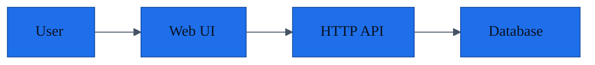

# Architecture

Status: current
Doc Type: baseline
Owner: maintainers
Last Verified: 2026-04-28
Confidence: medium

## Overview

The app uses a web client, an HTTP API, and a relational database.

## Boundaries

- Web UI owns presentation and client-side validation.
- API owns authorization, persistence, and business rules.
- Database stores users, issues, labels, and status history.

## Open Questions

- Background job processing is not documented in this example.
