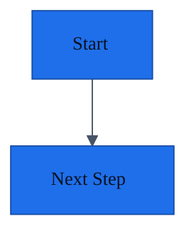

# Repo Memory Skill

Version: 1.6

## Overview

Use this skill to apply the Repo Memory portable standard to a repository. Repo Memory keeps project context in maintained Markdown docs close to the code. Apply one standard structure across new and existing repositories, reconstruct missing documentation from source evidence when needed, then keep it current as features are researched, implemented, verified, paused, recovered, and handed off.

Read [STANDARD.md](./STANDARD.md) when you need the portable standard, conformance model, required behaviors, and the distinction between standard and platform adapters.
Read [references/templates.md](./references/templates.md) when the repo needs a default structure, default file set, or example feature-tracking documents.
Read [references/existing-project-audit.md](./references/existing-project-audit.md) when the repo is already populated but does not comply with the documentation standard, or when you need to backfill architecture, requirements, decisions, or feature state from code and history.
Read [references/docs-structure-rules.md](./references/docs-structure-rules.md) for the strict naming conventions, placement rules, and enforcement checklist that all documentation must satisfy.
Read [references/documentation-metadata-schema.md](./references/documentation-metadata-schema.md) for the standard metadata fields, required doc-type fields, allowed values, and examples that make docs machine-checkable and agent-consistent.
Read [references/decision-log-reconstruction.md](./references/decision-log-reconstruction.md) when creating or updating a decision log, especially for existing projects where durable choices must be reconstructed from code, requirements, project history, user statements, and inferred architecture.
Read [references/continuity-governance.md](./references/continuity-governance.md) when docs change materially, conflict with code or each other, become stale, features end unexpectedly, docs are renamed, or multiple agents may be working concurrently.
Read [references/superpowers-compatibility.md](./references/superpowers-compatibility.md) when a repository also uses Obra Superpowers specs or plans, or another companion spec/plan workflow that stores artifacts outside the canonical Repo Memory docs.
Read [examples/README.md](./examples/README.md) when you need a concrete reference output for an adopted docs tree or multi-agent handoff.
Run `python3 <skill-dir>/scripts/scaffold-docs.py <repo> --with-agents` when the target repo is empty or nearly empty and needs the default docs skeleton before there is code to audit.
Run `python3 <skill-dir>/scripts/validate-docs.py --project-docs <repo>` when you need a lightweight local check for a target repo that adopted the standard.
Run `python3 <skill-dir>/scripts/forward-test.py --fixture-only` when you need disposable blind-test fixtures for skill behavior, and run live forward tests manually when token cost and local Codex auth are acceptable.
When running ad hoc Python validation inside a target repo, prefer `python3 -B ...` or `PYTHONDONTWRITEBYTECODE=1 python3 ...` so validation does not leave `__pycache__` artifacts behind.

Resolve `<skill-dir>` to the directory containing this `SKILL.md`. When working from this repository root, use `skills/repo-memory/scripts/...`.

## Core Principle

Prefer one stable documentation system per repository:

- one source of truth for baseline project-level docs
- one registry for tracked features
- one primary feature document for ongoing work
- optional deep-dive docs for project-specific topics, complex subsystems, and feature or component logic
- one implementation log for what actually landed
- one comprehensive decision log for lasting technical choices from project start to current state
- one doc-health record for freshness, verification, known drift, and conflict state
- one metadata schema that describes what each doc type must record
- one evidence-based adoption path for existing repos that are missing trustworthy docs
- one canonical project-docs layer that agent-specific instruction files point to instead of duplicating
- one provenance trail for substantial plans, specialist reviews, and tool-generated guidance that another agent may need to trust, verify, or implement

Do not create overlapping documentation systems unless the repository already forces it.
When another workflow already creates spec or plan artifacts, such as Obra Superpowers files under `docs/superpowers/specs/` or `docs/superpowers/plans/`, treat those artifacts as linked evidence and provenance. Keep accepted durable facts, current implementation state, decisions, validation, and handoff notes in the owning Repo Memory docs.

Every deep-dive document should have an obvious owner and entrypoint. Baseline docs summarize; deep-dive docs hold the details that would otherwise make the baseline unreadable.

## Depth Model

Use two layers:

- baseline docs for stable project-wide understanding, contracts, requirements, and operational posture
- deep-dive docs for project-specific details, subsystem internals, feature logic, component rules, edge cases, or state flows that need more depth than the baseline should carry

Default deep-dive locations:

- `docs/diagrams/` for diagram sources, exports, and diagram indexes
- `docs/project-details/<topic-slug>.md` for project-specific domain rules, workflows, or integration details
- `docs/components/<component-slug>.md` for reusable subsystem or component behavior
- `docs/designs/<design-slug>.md` for substantial proposed or recently adopted designs
- `docs/reviews/<review-slug>.md` for substantive specialist or second-agent reviews that are too large to keep inside the owning feature, design, UI/UX, or component doc
- `docs/ui-ux/<topic-or-flow-slug>.md` for user journeys, surfaces, interaction states, and accessibility notes
- `docs/features/<feature-slug>/logic.md` for feature-specific logic, state transitions, or algorithms
- `docs/features/<feature-slug>/components/<component-slug>.md` when a feature has component logic that should live beside the feature instead of in the shared component registry

Do not let deep-dive docs become orphaned. Link them from the owning baseline doc, feature doc, or index file.

Do not create optional deep-dive folders or empty index-only folders just to make the docs tree look complete. Create `docs/diagrams/`, `docs/designs/`, `docs/project-details/`, `docs/components/`, `docs/reviews/`, `docs/ui-ux/`, or feature deep-dive folders only when there is real owned content that would make the baseline or feature doc too long or too hard to maintain.

Additional focused docs when relevant:

- `docs/local-development.md` for local setup, scripts, tooling, codegen, fixtures, and contributor workflows
- `docs/requirements/user-stories-and-use-cases.md` for user-facing or workflow-heavy products that need comprehensive actors, stories, journeys, and acceptance paths

## Diagram Rules

Treat diagrams as documentation assets, not disposable exports.

- preserve existing diagram sources such as `.mmd`, `.mermaid`, `.drawio`, `.drawio.svg`, and checked-in rendered `.svg` or `.png` files when they are already part of the repo workflow
- do not convert existing `.drawio` or `.mmd` diagrams just to normalize formats unless there is a clear maintenance benefit
- prefer Mermaid syntax inside Markdown docs for small and medium diagrams that benefit from living beside the text
- use standalone `.mmd` files in `docs/diagrams/` when a Mermaid diagram is large, reused, or easier to maintain separately
- keep `.drawio` when the team already edits diagrams visually or when the diagram would be painful to maintain in Mermaid
- always link diagrams from the owning doc, feature doc, design doc, or diagram index so they do not become orphaned

Encourage Mermaid-first documentation for new text-centric diagrams because it is diffable, reviewable, and works well in Markdown.

### Default Mermaid Theme

When embedding Mermaid in Markdown, prefer a default accessible theme block. Use a neutral light theme with high contrast and restrained accent colors. The goal is to keep text, borders, and connectors clearly readable against the background, avoid low-contrast color pairings, and use accents sparingly so diagrams remain understandable for readers with common color-vision differences.

Default snippet:

````md

````

If the repo or Markdown renderer supports a shared Markdown theme, align Mermaid colors and typography to that theme. If Markdown theming is not supported, keep Mermaid self-contained with an `init` block instead of assuming global styling exists.

## Evidence Rules

When documenting an existing project, prefer evidence in this order:

1. source code, tests, schemas, and runtime configuration
2. build, deploy, CI, and local setup artifacts
3. existing repository documentation
4. git history, changelog entries, issue or PR references when available
5. user statements and prior chat context

Use strong evidence for current behavior. Use rationale evidence for decisions. Do not present guessed rationale as confirmed fact.

Decision logs must include a confidence level for every reconstructed decision. Explicit user statements, ADRs, code comments, and current implementation evidence can support high-confidence entries. Inferred rationale must be marked as inferred instead of being written as confirmed intent.

If something is not fully supported by evidence:

- mark it as inferred
- record the uncertainty or open question
- keep the docs useful instead of waiting for perfect certainty

Comprehensive documentation is better than sparse documentation, but unsupported claims are worse than explicit uncertainty.

## Cross-Agent Continuity Rules

Treat the maintained project docs as the canonical handoff surface across coding agents.

- keep durable project facts, active feature state, validation status, blockers, and next steps in the project docs, not only in chat history
- keep agent-specific instruction files such as `AGENTS.md`, `.github/copilot-instructions.md`, `CLAUDE.md`, or similar files thin; they should tell agents where the canonical docs live and how to update them
- if multiple agent entrypoint files exist, align them to the same documentation workflow instead of letting each file define a competing source of truth
- make every active feature doc resumable without prior chat context: another agent should be able to read the feature doc and continue safely
- record the last verified state, the next safe step, blockers, risks, and the first files or docs to inspect before stopping
- record provenance for substantial plans and reviews: who or what produced it, tool or agent surface, requested role or lens, date, inputs reviewed, assumptions, confidence, disposition, and where accepted outcomes were applied
- link companion spec or plan artifacts, such as `docs/superpowers/specs/...` and `docs/superpowers/plans/...`, from the owning feature or design doc when they materially inform implementation
- when resuming after a crash, interruption, or unknown previous agent state, inspect the working tree before editing and preserve uncommitted or untracked work until it is understood
- prefer agent-neutral wording in reusable docs and templates so Copilot, Codex, Claude, and similar coding agents can follow the same workflow
- use the standard metadata fields from [references/documentation-metadata-schema.md](./references/documentation-metadata-schema.md) when creating or refreshing docs so different agents record ownership, status, verification, evidence, and relationships consistently

## Continuity Governance Rules

Treat documentation as maintained system state. When project reality changes, update the docs using a visible lifecycle instead of silently editing whichever file seems closest.

- update `docs/doc-health.md` whenever a baseline doc, feature doc, deep-dive doc, diagram, or agent instruction file is created, materially changed, known stale, or re-verified
- if code and docs disagree, treat source code, tests, schemas, runtime config, and deployment artifacts as the strongest current-behavior evidence, then update docs and record the correction
- if docs disagree with each other, preserve the more specific doc as the detailed source, update the baseline summary, and link both places clearly
- preserve useful custom docs such as ADRs, product notes, RFCs, support docs, and design notes; link them from the canonical docs instead of replacing them with duplicate summaries
- if user statements or chat context override existing docs, record the statement as evidence and mark any older doc statement as superseded or corrected
- when architecture, contracts, data model, security posture, local tooling, or operations change materially, update the affected baseline doc, decision log, implementation log, doc-health record, and any owning design or feature docs in the same work
- when renaming a feature, component, design, topic, or diagram slug, update every reference and record the old slug in the affected registry or index until the transition is obvious
- when a feature is abandoned, superseded, deprecated, or rolled back, keep the feature doc and registry entry; mark the terminal status and explain what replaced it or why it stopped
- when a feature becomes `implemented`, `verified`, or `shipped`, update the feature doc `Status`, update the registry entry, and replace interrupted-work handoff wording with completed-state handoff: latest verified state, remaining validation gaps, and the next safe maintenance step
- when multiple agents may work concurrently, feature docs must state active ownership, files or docs to avoid, safe parallel work, and the latest verified state
- when one agent creates a plan for another agent to implement, keep the implementable summary and pickup instructions in the owning feature or design doc; link any larger plan artifact from there and treat it as advisory until verified against current code and user intent
- when a companion workflow creates separate spec or plan files, read the relevant artifacts before continuing related work, then promote accepted outcomes into the canonical Repo Memory docs instead of leaving state only in that companion folder
- when a different role or specialist agent reviews work, record short reviews in the owning doc `Review Log`; create `docs/reviews/<review-slug>.md` only when the review is substantive, cross-cutting, or likely to be audited later
- when a plan or review changes requirements, UX, architecture, contracts, or implementation state, update the canonical owning docs and record the accepted disposition instead of leaving the result only in a review artifact
- when interrupted work is discovered, record what was found, what was verified, what remains uncertain, and the next safe step in the affected feature doc or `docs/doc-health.md`
- after running tests or validation, remove disposable generated artifacts you created, such as `__pycache__`, `.pytest_cache`, `.DS_Store`, or `agent-final.txt`, unless the repo intentionally tracks or ignores them; for Python one-off checks, prefer `python3 -B` or `PYTHONDONTWRITEBYTECODE=1` to avoid creating `__pycache__` in the first place

Use [references/continuity-governance.md](./references/continuity-governance.md) for the detailed protocols.

## Workflow

### 1. Detect the repository state

Classify the repo into one of three modes:

1. `new_project`
   The repo has little or no documentation structure. If it is empty or nearly
   empty, initialize the standard skeleton before trying to reconstruct facts.
2. `existing_project_needs_standardization`
   The repo has docs, but they are incomplete, inconsistent, or not useful for agent handoff.
3. `existing_project_with_structure`
   The repo already has a workable documentation structure that should be preserved and strengthened.

Start by checking:

- `AGENTS.md` or similar repo instructions
- `docs/`
- top-level docs like `README.md`, `FEATURE_REQUIREMENTS.md`, architecture notes, ADRs, or changelog-style files

For a truly empty repository, do not wait for implementation evidence before
creating docs. Bootstrap the skeleton, mark unknowns explicitly, and leave the
repo ready for future facts to be filled in.

### 1a. Bootstrap an empty repository

When the target repo has no useful source files or docs, create the baseline
documentation skeleton:

```bash
python3 <skill-dir>/scripts/scaffold-docs.py /path/to/repo --with-agents
```

Use `--project-name "<name>"` when the directory name is not the right project
name. Use `--include-user-stories` when the project already has known users,
actors, journeys, or workflow expectations. Use `--dry-run` to inspect the
files before writing them.

The scaffold creates the required `docs/` baseline, `docs/requirements/`,
`docs/features/_template.md`, initial decision and implementation log entries,
and a doc-health record that marks the skeleton placeholders as unverified.
With `--with-agents`, it also creates a thin root `AGENTS.md` that points agents
to the docs tree.

After scaffolding:

1. Replace placeholders only with confirmed user statements or evidence.
2. Keep unknowns and assumptions explicit.
3. Run `python3 <skill-dir>/scripts/validate-docs.py --project-docs /path/to/repo`.
4. Leave the repo with a usable docs map even if implementation has not started.

### 2. Run a documentation audit

Before standardizing an existing project, inventory the evidence:

- code structure and major modules
- durable architectural, stack, tooling, product-scope, integration, data, UI, testing, operations, documentation, and security decisions
- domain concepts, business rules, and critical workflows
- user types, user journeys, use cases, and acceptance expectations when the system has end users
- tests and their behavioral expectations
- package manifests, lockfiles, and runtime config
- instrumentation points, logs, metrics, traces, analytics events, audit events, dashboards, and alert signals
- local scripts, task runners, codegen, devcontainers, fixtures, mocks, and contributor tooling
- deployment, CI, Docker, and setup scripts
- agent entrypoint files such as `AGENTS.md`, `.github/copilot-instructions.md`, `CLAUDE.md`, or other repo-level agent instructions
- state transitions, background jobs, event flows, or UI flows that encode non-obvious logic
- checked-in diagrams, architecture sketches, `.mmd`, `.drawio`, exported SVGs, and their owning docs
- UX states, accessibility behavior, responsive behavior, and design constraints when the system has a UI
- extension points, compatibility constraints, migrations, flags, and deprecation paths that affect future evolution
- existing docs and legacy source-of-truth files
- recent feature-related commits or changelog history when available

Use the audit process in [references/existing-project-audit.md](./references/existing-project-audit.md).

The purpose of the audit is to answer:

- what docs already exist
- which target docs can be confirmed from evidence
- where rationale is missing
- which features or subsystems need retrospective documentation
- which project-specific details or component logic need deep-dive documentation
- whether user stories, UI or UX docs, design docs, or local tooling docs need first-class coverage
- whether substantial plans or specialist reviews need provenance records, and whether their accepted outcomes have been promoted into the owning canonical docs
- whether target users, personas, actors, success criteria, acceptance paths, and non-goals are explicit enough for another agent to preserve product intent
- whether observability and instrumentation are documented well enough to understand runtime health, product signals, alerts, audit trails, and privacy boundaries
- whether existing diagrams should be preserved, linked, reorganized, or supplemented with Mermaid docs
- which future-evolution assumptions should be captured explicitly
- which unknowns must remain explicit
- whether agent instruction files duplicate mutable project knowledge that should move into the canonical docs set

### 3. Choose the source of truth

If the repo already has a clear documentation standard, adopt it instead of replacing it.

If there is no clear standard, create a `docs/` structure and make it the source of truth. The default structure is in [references/templates.md](./references/templates.md).

Prefer a small set of well-maintained baseline docs plus a small number of well-linked deep-dive docs over many stale documents.

When agent-specific instruction files exist, make them entrypoints into the documentation system instead of parallel documentation systems.

### 4. Reconstruct the current system for existing repos

When the repo lacks compliant documentation, backfill the standard docs from evidence.

At minimum:

- reconstruct architecture from service boundaries, entrypoints, modules, and runtime topology
- reconstruct functional requirements from APIs, tests, UI flows, and current behavior
- reconstruct non-functional constraints from deployment, setup, CI, limits, and failure handling
- reconstruct local development and tooling expectations from scripts, setup files, generators, mocks, and contributor workflows
- reconstruct observability and instrumentation expectations from logging, telemetry, analytics, tracing, monitoring, alerting, and audit-event code or config
- reconstruct interfaces and contracts from handlers, schemas, DTOs, tool definitions, and API clients
- reconstruct the data model from types, schemas, storage code, migrations, and persistence layers
- reconstruct user stories, use cases, and UI or UX expectations when the product has meaningful user-facing flows
- reconstruct or link important diagrams from checked-in `.mmd`, `.drawio`, architecture sketches, and design artifacts
- reconstruct project-specific logic from validators, workflows, state machines, selectors, background jobs, and operational artifacts
- reconstruct future-evolution constraints from extension points, compatibility layers, flags, migrations, and known roadmap-facing design choices
- reconstruct active or recent feature state from touched files, tests, branches, and logs

Do not stop after a README-quality summary. Populate the full standard doc set with concise baseline content, then add targeted deep-dive docs where the codebase has important logic that does not fit cleanly in the baseline.

### 5. Extract decisions and implementation history carefully

For an existing project, separate these concepts:

- current system shape
- implementation history
- intended decision rationale

Use these rules:

- reconstruct a comprehensive decision inventory, not only the most recent or most obvious decisions
- include durable choices that shaped the project from the start: framework, template/starter, deployment target, package manager, folder structure, data model boundaries, validation, state management, integration patterns, UI system, testing, operations, documentation workflow, and explicitly deferred scope
- if a choice is visible in code but rationale is unknown, add the decision with evidence and confidence, and mark rationale as inferred or unknown
- use explicit user statements as first-class rationale evidence
- add a confidence label to every decision entry: `high`, `medium`, or `low`
- include consequences or follow-up implications so future agents understand what the decision means in practice
- when in doubt, record a brief note such as `Rationale inferred from current implementation and supporting artifacts`

Use [references/decision-log-reconstruction.md](./references/decision-log-reconstruction.md) for the decision inventory checklist, confidence rules, and entry template.

- backfill implementation-log entries for major recent features or migrations when that history is needed to understand the current system

### 6. Establish the standard project docs

For repos that need a default standard, maintain these documents:

- `docs/README.md`
- `docs/project-overview.md`
- `docs/architecture.md`
- `docs/requirements/functional-requirements.md`
- `docs/requirements/non-functional-requirements.md`
- `docs/interfaces-and-contracts.md`
- `docs/data-model.md`
- `docs/local-development.md`
- `docs/doc-health.md`
- `docs/observability-and-instrumentation.md`
- `docs/testing-strategy.md`
- `docs/operations-runbook.md`
- `docs/security-and-privacy.md`
- `docs/decision-log.md`
- `docs/implementation-log.md`
- `docs/feature-registry.md`
- `docs/features/<feature-slug>.md` for active or important features

Add these deep-dive docs when the project genuinely needs them:

- `docs/requirements/user-stories-and-use-cases.md`
- `docs/diagrams/README.md`, `docs/diagrams/<topic-slug>.mmd`, and checked-in `.drawio` or exported assets when diagrams are part of the documentation workflow
- `docs/project-details/README.md` and `docs/project-details/<topic-slug>.md`
- `docs/components/README.md` and `docs/components/<component-slug>.md`
- `docs/designs/README.md` and `docs/designs/<design-slug>.md`
- `docs/reviews/README.md` and `docs/reviews/<review-slug>.md`
- `docs/ui-ux/README.md` and `docs/ui-ux/<topic-or-flow-slug>.md`
- `docs/features/<feature-slug>/logic.md`
- `docs/features/<feature-slug>/components/<component-slug>.md`

Only add deep-dive documents when the behavior is important, detailed, and not already captured well enough in the baseline or primary feature doc.
Do not add empty optional indexes such as `docs/diagrams/README.md`, `docs/designs/README.md`, `docs/project-details/README.md`, `docs/components/README.md`, `docs/reviews/README.md`, or `docs/ui-ux/README.md` unless the folder also has real topic docs or existing assets to index.

For existing repositories, treat these as the minimum comprehensive baseline, not as optional nice-to-haves.

Each document should include the metadata required by its doc type. Use [references/documentation-metadata-schema.md](./references/documentation-metadata-schema.md) for field names, allowed values, and examples.

### 7. Maintain feature continuity

For any non-trivial feature, bug fix, integration, refactor, or research thread that another agent might resume:

1. Find or create the feature entry in `docs/feature-registry.md`.
2. Find or create `docs/features/<feature-slug>.md`.
3. If the feature changes user journeys, acceptance behavior, or UI states, update `docs/requirements/user-stories-and-use-cases.md` or `docs/ui-ux/...` when those docs exist or should exist.
4. If the feature has non-trivial workflows, state, edge cases, algorithms, or feature-specific component behavior, add linked deep-dive docs under `docs/features/<feature-slug>/`.
5. If the feature introduces a durable design or major tradeoff, add or update a design doc in `docs/designs/`.
6. If the feature depends on a plan produced by another agent or tool, record the plan provenance and implementation pickup in the feature or design doc before editing.
7. If a specialist, second-agent, human, or tool review materially informs the work, add a short `Review Log` entry or link a substantive `docs/reviews/<review-slug>.md` record.
8. Keep the feature document current during the work.
9. Leave a clean `Next Agent Handoff` section before ending the session. If the scoped work is implemented, verified, or shipped, set the feature doc `Status` and feature registry row to the matching terminal state. For terminal feature states, remove stale wording such as `interrupted`, `resume carefully`, or `do not discard uncommitted work` unless unresolved uncommitted work still exists and is explicitly documented as a current risk.
10. If the repo uses multiple agent instruction files, keep them aligned to the same feature doc and docs entrypoints.

Use one explicit status model:

- `research`
- `planned`
- `in_progress`
- `blocked`
- `implemented`
- `verified`
- `shipped`
- `abandoned`
- `superseded`
- `deprecated`
- `rolled_back`

For existing repos, also create retrospective feature docs for active, recently changed, or operationally important work when that context is required to understand the current system.

### 8. Update the right docs when work changes

Use this mapping:

- behavior changes: update functional requirements
- quality expectations or runtime assumptions change: update non-functional requirements
- user journeys, actors, or acceptance paths change: update `docs/requirements/user-stories-and-use-cases.md`
- project goal, problem statement, target users, success criteria, scope, or non-goals change: update `docs/project-overview.md`
- API, MCP, or payload changes: update interfaces and contracts
- schema, entities, or field ownership changes: update data model
- local setup, scripts, codegen, fixtures, or contributor workflow changes: update `docs/local-development.md`
- diagrams, architecture views, sequence flows, or state visuals change: update `docs/diagrams/...` and links from the owning docs
- runtime commands or troubleshooting change: update operations runbook
- logs, metrics, traces, analytics, audit events, dashboards, or alerts change: update observability and instrumentation
- risk posture or external data handling changes: update security and privacy
- project-specific domain rules, workflows, or integration quirks change: update `docs/project-details/...`
- reusable component or subsystem behavior changes: update `docs/components/...`
- specialist review findings, second-agent critiques, or advisory plan outputs materially affect implementation: update the owning feature/design doc and optionally `docs/reviews/...`
- major proposed or adopted solution shape changes: update `docs/designs/...`
- screen flows, interaction rules, accessibility, or responsive behavior change: update `docs/ui-ux/...`
- feature-only flows, state machines, edge cases, or algorithms change: update `docs/features/<feature-slug>/...`
- extension points, compatibility assumptions, migration paths, or deprecation strategy change: update architecture, design docs, and decision log
- enduring technical choices change: update decision log
- meaningful work lands: update implementation log
- active feature state changes: update feature doc and feature registry
- docs are created, materially changed, verified, found stale, renamed, or superseded: update `docs/doc-health.md`
- doc type, ownership, status, evidence, or verification metadata changes: update the document metadata according to `documentation-metadata-schema.md`

### 9. Standardize existing repos carefully

When adopting an existing project:

1. preserve useful existing docs
2. absorb old source-of-truth files into the new structure where practical
3. leave lightweight pointers from legacy docs if other workflows still reference them
4. do not duplicate the same contract in multiple places unless there is a clear transition reason
5. do not create orphan deep-dive docs without links from the relevant baseline doc, feature doc, or index
6. record unknowns and inferred statements instead of pretending the reconstruction is complete
7. collapse duplicated mutable guidance out of agent-specific instruction files into the canonical docs set where practical

Favor convergence, not churn.

### 10. Leave the repo resumable

Before stopping, make sure another agent can determine:

- what the project is
- how it is structured
- what changed
- what is in progress
- what is blocked
- where project-specific or feature-specific logic is documented
- what the next safe step is
- which docs are canonical and which agent-specific files only point to them
- which docs were verified, which are stale, and where conflicts or renamed docs were recorded

If the docs do not answer those quickly, improve them before ending the session.

## Deep-Dive Doc Rules

Use deep-dive docs deliberately:

- `docs/diagrams/` is for maintained diagram sources, exports, and indexes, especially when diagrams are shared across multiple docs
- `docs/project-details/` is for project-specific knowledge that is too detailed, too domain-specific, or too operationally quirky for the baseline set
- `docs/components/` is for shared components or subsystems that cut across features, especially when they have invariants, lifecycle rules, or tricky failure modes
- `docs/designs/` is for non-trivial designs, proposed approaches, and major changes where goals, tradeoffs, rollout, and future evolution should be preserved
- `docs/reviews/` is for substantive specialist, second-agent, tool-generated, or human review records that need provenance and disposition tracking
- `docs/ui-ux/` is for user journeys, screen or state definitions, interaction behavior, accessibility notes, and responsive rules that should not be buried in engineering-only docs
- `docs/features/<feature-slug>/` is for feature-only logic, state transitions, algorithms, interaction flows, and feature-local component behavior

Each deep-dive doc should usually capture:

- purpose and scope
- owner doc or related feature
- main logic or workflow
- invariants and assumptions
- edge cases or failure modes
- related code and related docs

If a baseline doc can reasonably hold the information without becoming noisy, keep it there. Deep-dive docs are for clarity, not for bureaucracy.

## Coverage Expectations

For a mature documentation system, cover these areas when relevant:

- project goal, problem statement, target users or actors, success criteria, current scope, and non-goals in `docs/project-overview.md`
- thorough user stories and use cases in `docs/requirements/user-stories-and-use-cases.md` for user-facing, workflow-heavy, or multi-actor systems, including actors, personas, journeys, alternative flows, failure states, permissions, accessibility needs, and acceptance notes
- data model details in `docs/data-model.md`, including major entities, ownership, relationships, lifecycle, and schema-relevant constraints
- edge cases and failure modes in feature logic, component docs, project-details docs, and UI or UX docs when they materially affect behavior
- local tooling in `docs/local-development.md`, including setup, commands, scripts, codegen, local services, fixtures, and troubleshooting
- observability and instrumentation in `docs/observability-and-instrumentation.md`, including logs, metrics, traces, analytics events, audit events, dashboards, alerts, retention, sampling, privacy boundaries, and known blind spots
- doc freshness and known drift in `docs/doc-health.md`, including last verified evidence, stale areas, conflicts, and renamed or superseded docs
- doc metadata in every maintained doc, including doc type, owner, status, last updated, last verified, confidence, canonical source, related docs, and supersession state where relevant
- future-proofing in architecture, design docs, and decision log entries, including extension points, compatibility assumptions, migration paths, and deprecation intent
- design docs in `docs/designs/` for major changes, proposals, or durable solution shapes
- review records in `docs/reviews/` when a plan or specialist review materially affects implementation and needs provenance beyond a short feature-doc note
- UI or UX docs in `docs/ui-ux/` when flows, states, accessibility, copy, or responsive behavior matter to safe implementation
- diagrams in `docs/diagrams/` or embedded Mermaid blocks when visuals materially improve understanding of architecture, workflows, sequences, or state

## Feature Doc Rules

Each active feature document should capture:

- goal
- status
- research summary when relevant
- chosen decision or approach
- scope boundaries
- user impact or affected use cases when relevant
- links to supporting deep-dive docs when present
- implementation checklist
- files touched or expected to change
- open questions
- validation state
- next agent handoff

If useful, include an `Exact Next Prompt` section another agent can paste directly.

For existing projects, include a short `Evidence` or `Reconstruction Notes` section when the feature state was derived retrospectively from code, tests, or history.

The `Next Agent Handoff` should be agent-neutral and specific enough that a different tool or model can resume without needing prior chat context.

## Quality Bar

A good project documentation setup allows a new agent to answer these in under ten minutes:

- What does this project do?
- Who are the important users or actors, and what are the main use cases?
- What are the major architectural pieces?
- Where are the project-specific workflows or domain rules documented?
- Where do the maintained diagrams live, and which docs own them?
- What contracts matter?
- How does local setup and tooling work?
- Which docs are current, stale, or known to conflict with implementation?
- What are the current quality and operational constraints?
- What feature work is active?
- Where are the key edge cases, failure modes, and UI states documented?
- Where is the tricky feature or component logic documented?
- What design docs explain the major solution shapes or pending changes?
- What already landed?
- What decision history matters?
- What assumptions were made for future evolution?
- What should be done next?
- Which instruction files exist for different agents, and do they all point to the same canonical docs?

If the answer is no, tighten the docs structure or refresh stale files.

For an existing messy repo, the skill succeeds only if it produces a usable baseline across the full standard doc set, not just a high-level summary plus one or two polished docs.

## Default Adoption Strategy

Use this strategy when no better repo-specific process exists:

1. audit the repo and inventory evidence
2. bootstrap `docs/` with the standard file set, using the bundled `scripts/scaffold-docs.py` helper for empty or nearly empty repos
3. populate each standard doc with current known state from evidence
4. add `docs/requirements/user-stories-and-use-cases.md` when the project has important actors, journeys, or workflow variants
5. populate `docs/observability-and-instrumentation.md` with known runtime signals, product events, alerts, dashboards, audit trails, and blind spots
6. create `docs/feature-registry.md`
7. add `docs/diagrams/`, `docs/project-details/`, `docs/components/`, `docs/designs/`, `docs/reviews/`, or `docs/ui-ux/` only for topics that need deeper treatment
8. create per-feature docs for active, recent, or important work
9. add feature-level deep-dive docs only when the feature has meaningful internal logic to preserve
10. note unknowns, inferred statements, and missing rationale explicitly
11. populate `docs/doc-health.md` with verification state, stale areas, and known conflicts
12. align any repo-level agent instruction files to the same docs entrypoints and source-of-truth rules
13. update the docs in the same change as the code
14. remove disposable generated artifacts created by validation or testing
15. leave exact handoff notes before stopping

Use [references/templates.md](./references/templates.md) for the default structure and templates.
Use [references/existing-project-audit.md](./references/existing-project-audit.md) when extracting documentation from an existing codebase.
Use [references/docs-structure-rules.md](./references/docs-structure-rules.md) to verify all naming conventions and placement decisions before committing.
Use [references/documentation-metadata-schema.md](./references/documentation-metadata-schema.md) to apply consistent metadata fields across doc types.
Use [references/continuity-governance.md](./references/continuity-governance.md) to resolve conflicts, rename docs, close abandoned work, and keep doc freshness visible.

For blind forward testing, use `scripts/forward-test.py`. Keep child-agent prompts task-like, pass the skill path explicitly, and write stdout/final-message logs outside the fixture repository so generated harness artifacts do not contaminate scoring.
