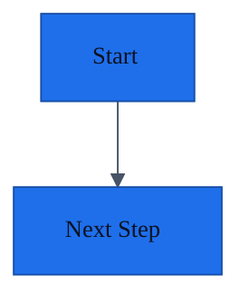
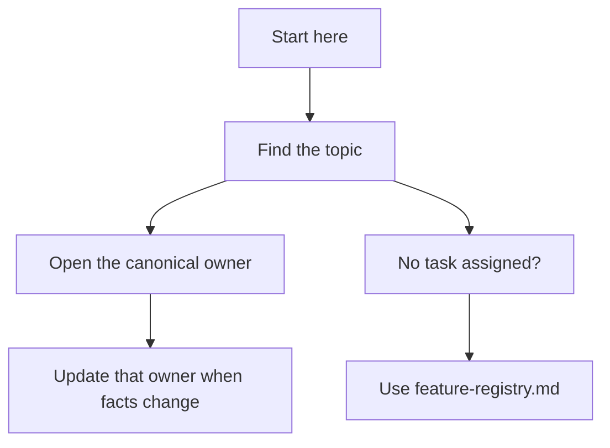

# Project Documentation Templates

Use these templates when the repository does not already define a stronger format.

## Default Docs Structure

```text
docs/
├── README.md
├── intake/                         # raw brainstorms, project dumps, and planning output
│   └── README.md
├── project-overview.md
├── architecture.md
├── interfaces-and-contracts.md
├── data-model.md
├── local-development.md
├── doc-health.md
├── observability-and-instrumentation.md
├── testing-strategy.md
├── operations-runbook.md
├── security-and-privacy.md
├── decision-log.md
├── implementation-log.md
├── feature-registry.md
├── diagrams/                       # optional diagram sources and exports
│   ├── README.md
│   ├── <topic-slug>.mmd
│   ├── <topic-slug>.drawio
│   └── exports/
│       └── <topic-slug>.svg
├── designs/                        # optional design docs and proposals
│   ├── README.md
│   └── <design-slug>.md
├── project-details/                # optional project-specific deep dives
│   ├── README.md
│   └── <topic-slug>.md
├── components/                     # optional shared subsystem or component docs
│   ├── README.md
│   └── <component-slug>.md
├── reviews/                        # optional review records
│   ├── README.md
│   └── <review-slug>.md
├── ui-ux/                          # optional user journeys, states, accessibility notes
│   ├── README.md
│   └── <topic-or-flow-slug>.md
├── superpowers/                     # optional companion workflow artifacts
│   ├── specs/
│   │   └── <date>-<topic>.md
│   └── plans/
│       └── <date>-<topic>.md
├── requirements/
│   ├── functional-requirements.md
│   ├── non-functional-requirements.md
│   └── user-stories-and-use-cases.md  # required for user-facing or workflow-heavy systems
└── features/
    ├── _template.md
    ├── <feature-slug>.md
    └── <feature-slug>/             # optional feature deep-dive folder
        ├── logic.md
        └── components/
            └── <component-slug>.md
```

For existing projects, start with the capability owners the repo already has.
Use the baseline files as defaults only for capabilities with no trustworthy
existing owner.

## Partial Adoption Pattern for Existing Repos

When a repo already has useful architecture notes, ADRs, RFCs, wiki pages, or
team-specific runbooks, keep them if they still help. Do not force an immediate
rewrite just to match the full baseline.

The usual minimal add-first set is:

- `docs/README.md` to define the canonical ownership map
- `docs/feature-registry.md` to track active work and the next ready task
- `docs/doc-health.md` to record freshness, conflicts, and verification state
- `docs/features/<feature-slug>.md` for active or risky work that needs resumable handoff
- a thin repo-level agent entrypoint that points into the ownership map

That partial setup improves cross-agent continuity immediately. Expand toward
the full baseline when the repo needs stronger standardization or verification.

## Canonical Ownership Map Template

Use this in `docs/README.md` for any Level 1 or higher adoption. It prevents
Repo Memory from duplicating ADRs, runbooks, API specs, setup docs, or other
healthy existing documentation.

```md
## Canonical Ownership Map

| Capability                          | Canonical owner                   | Supporting docs                    | Notes                                                            |
| ----------------------------------- | --------------------------------- | ---------------------------------- | ---------------------------------------------------------------- |
| Documentation map and ownership map | `docs/README.md`                  | `AGENTS.md`                        | This table owns routing, not all project facts.                  |
| Decisions and rationale             | `docs/adr/`                       | `docs/decision-log.md`             | ADRs are canonical; decision log links or indexes only.          |
| Interfaces and contracts            | `openapi.yaml`                    | `docs/interfaces-and-contracts.md` | OpenAPI is canonical; prose explains usage and gaps.             |
| Local development and tooling       | `CONTRIBUTING.md`                 | `README.md`                        | Do not duplicate setup commands elsewhere.                       |
| Active feature handoff              | `docs/features/<feature-slug>.md` | `docs/feature-registry.md`         | Repo Memory owns resumable feature state.                        |
| Documentation health and conflicts  | `docs/doc-health.md`              | None                               | Tracks stale docs, duplicate-owner migrations, and verification. |
```

Each capability should appear once. Put alternatives, legacy docs, and detail
sources in `Supporting docs`, not in `Canonical owner`.

The `docs/diagrams/`, `docs/designs/`, `docs/project-details/`, `docs/components/`, `docs/reviews/`, `docs/ui-ux/`, and per-feature deep-dive folders are optional. Add them when the codebase has maintained diagrams, design decisions, project-specific behavior, substantive reviews, user-flow complexity, or feature or component logic that another agent would otherwise have to reverse-engineer. Do not create empty optional folders or index-only optional folders as placeholders.

`docs/intake/` is also different: it is a raw source-material inbox for brainstorms, copied chat notes, imported plans, and user-provided project dumps. Use it to collect context without forcing a template, then promote accepted facts into mapped owners before building from them.

`docs/superpowers/` is different: it is an optional companion workflow folder for Obra Superpowers specs and plans, not a Repo Memory deep-dive folder. Link those artifacts from owning feature or design docs and promote accepted outcomes into mapped owners.

## Empty Repository Scaffold

Use the scaffold helper when a target repository has no useful implementation
or documentation evidence yet:

```bash
python3 <skill-dir>/scripts/scaffold-docs.py /path/to/repo --with-agents
```

Resolve `<skill-dir>` to the installed `repo-memory` skill directory. When
working from this repository root, use `skills/repo-memory/scripts/...`.

The scaffold creates the default baseline docs, ownership map,
`docs/requirements/`, `docs/features/_template.md`, `docs/intake/README.md`,
initial decision and implementation log entries, and a doc-health note that
marks the placeholders as unverified. Add
`--include-user-stories` when users, actors, journeys, or acceptance paths are
already known. Use `--project-name "<name>"` when the target directory name is
not the right project name.

After scaffolding, replace TODOs only with confirmed facts, user statements, or
clearly marked inference. Keep unknowns explicit until implementation evidence
exists.

## Raw Intake README Template

Use this template for `docs/intake/README.md` when a repo needs a low-friction
place for brainstorms, planning dumps, copied chat notes, or imported project
context before those details are promoted into mapped owners.

```md
# Intake

Use this folder as a low-friction inbox for raw brainstorms, project notes,
chat exports, AI plans, sketches, or imported planning docs that have not yet
been promoted into mapped owners.

## How to Use

- Drop raw source material here when it is useful but not yet structured.
- Prefer kebab-case names for authored Markdown, but imported files can keep
  their source names.
- Do not treat raw intake as canonical project truth.
- Before building from an intake item, extract accepted facts into the relevant
  baseline, requirements, design, decision, feature, or handoff docs.
- Link important intake files from `Evidence`, `Plan Provenance`, or `Source artifacts`
  where they shaped accepted project direction.
- Record reviewed intake, unresolved questions, and stale or superseded source
  material in `../doc-health.md` when it affects future work.

## Suggested File Names

- `YYYY-MM-DD-initial-brainstorm.md`
- `YYYY-MM-DD-planning-notes.md`
- `YYYY-MM-DD-ai-plan.md`
```

## Common Metadata Block

Use this block near the top of maintained docs. See [documentation-metadata-schema.md](./documentation-metadata-schema.md) for allowed values and doc-type-specific fields.

```md
Doc type:
Owner:
Status:
Last updated:
Last verified:
Verified against:
Confidence:
Canonical source:
Related docs:
```

## Agent Instruction Snippet Template

Use this snippet in repo-level instruction files such as `AGENTS.md`, `.github/copilot-instructions.md`, `CLAUDE.md`, or similar agent entrypoints when the target repo should route agents to the canonical ownership map.

If the repo already has multiple agent entrypoints, keep them thin and align
them to the same ownership map rather than letting each file carry its
own mutable project state.

```md
## Documentation Source of Truth

This project uses Repo Memory for cross-agent continuity.

`docs/README.md` contains the Canonical Ownership Map. Update the mapped owner
for any changed capability. Do not duplicate mutable project facts in this file.

When starting or resuming work:

1. Read `docs/README.md`.
2. Run the validator (`python3 skills/repo-memory/scripts/validate-docs.py --project-docs --strict` when installed) to automatically check if documentation has drifted.
3. Follow the Canonical Ownership Map to the project overview, architecture, decision, contract, setup, and feature owners relevant to the task.
4. Review `docs/intake/` if it contains raw brainstorms, project notes, or plans relevant to the work, then promote accepted facts into the mapped owner.
5. Read `docs/feature-registry.md`; when no task is assigned, pick the first `ready` row in `Next Work Queue`.
6. Read the active `docs/features/<feature-slug>.md` before making changes.

When making changes:

- Update the active feature doc as the work changes.
- Update the `Next Work Queue` when priority, readiness, or pickup instructions change.
- Place companion plans/specs only in `docs/superpowers/plans/` or `docs/superpowers/specs/` (or `docs/designs/`).
- Update the mapped canonical owner for changed decisions, contracts, commands, architecture, runtime signals, or security posture.
- Put durable project facts in their mapped owner, not only in agent-specific instruction files or chat history.
- Keep any agent-specific instruction files short and aligned to the same docs entrypoints.

Before stopping:

- Run the validator (`python3 skills/repo-memory/scripts/validate-docs.py --project-docs --strict` when installed) and fix any warnings, errors, or plan-placement drift.
- Update `docs/features/<feature-slug>.md`, especially `Implementation Status`, `Validation`, `Resume Context`, `Next Agent Handoff`, and `Exact Next Prompt` when present.
- Update the mapped implementation-history owner for meaningful landed work.
- Update the mapped decision owner when a durable technical choice changed.
- Update `docs/doc-health.md` when docs were verified, corrected, found stale, or when duplicate ownership was removed.
```

## Deep-Dive Placement Rules

- Use `docs/requirements/user-stories-and-use-cases.md` for actors, user stories, end-to-end use cases, alternative flows, and acceptance paths in user-facing or workflow-heavy projects.
- Use `docs/intake/` for raw brainstorm dumps, copied chat notes, imported plans, sketches, and user-provided project context before accepted content is promoted into mapped owners.
- Use `docs/local-development.md` for local setup, scripts, tooling, fixtures, codegen, local services, and contributor troubleshooting.
- Use `docs/observability-and-instrumentation.md` for logs, metrics, traces, analytics events, audit events, dashboards, alerts, retention, sampling, and known blind spots.
- Use `docs/diagrams/` for maintained `.mmd`, `.drawio`, exported SVG or PNG assets, and diagram indexes.
- Use `docs/designs/` for substantial designs, proposals, rollout plans, tradeoffs, and future-evolution notes.
- Use `docs/project-details/` for domain workflows, business rules, integration quirks, deployment-specific behavior, or repo-specific conventions.
- Use `docs/components/` for shared subsystems, reusable UI components, state containers, orchestration layers, or services that span multiple features.
- Use `docs/reviews/` for substantive plan, specialist, or second-agent review records that need provenance beyond a short owning-doc note.
- Keep companion specs and plans such as `docs/superpowers/specs/...` and `docs/superpowers/plans/...` in their established workflow folder, then link them from the owning feature or design doc.
- Use `docs/ui-ux/` for user journeys, screens or surfaces, interaction states, accessibility requirements, content notes, or responsive rules.
- Use `docs/features/<feature-slug>/logic.md` for feature-local flows, state transitions, algorithms, edge cases, or event sequencing.
- Use `docs/features/<feature-slug>/components/` when the component logic only matters inside that feature and would be noise in the shared component registry.
- Keep small plan and review provenance inside the owning feature or design doc; create `docs/reviews/<review-slug>.md` only when the record is substantive, cross-cutting, or audit-worthy.
- Always link deep-dive docs from the parent feature doc, index, or relevant baseline doc.
- Do not create optional deep-dive folders until there is real content or an existing asset to index.

## Diagram Guidance

- Prefer Mermaid fenced blocks inside Markdown docs for small and medium diagrams that are easiest to review beside the prose.
- Prefer standalone `.mmd` files in `docs/diagrams/` when the diagram is large, shared, or reused across multiple docs.
- Preserve existing `.drawio` files when the team uses visual editing or when the diagram is not practical to maintain as Mermaid.
- Keep exported `.svg` or `.png` artifacts only when the repo already relies on rendered diagram assets or the Markdown target needs them.
- Link every maintained diagram from an owning doc such as `docs/architecture.md`, a design doc, a feature doc, or `docs/diagrams/README.md`.
- When Mermaid is used, prefer an explicit `init` block so the diagram remains readable even when the Markdown renderer does not provide shared theming.

## Default Mermaid Theme Snippet

````md

````

This default favors accessibility and readability: a light background, high-contrast text, restrained accent color, and readable font settings.

If the Markdown environment supports a shared theme, align Mermaid to that theme. If not, keep Mermaid self-contained with the `init` block.

## Feature Registry Template

```md
# Feature Registry

## Next Work Queue

| Rank | Work item                  | Type    | Status        | Ready   | Why next                        | Next safe step                                    | Canonical doc                                                                        | Last verified |
| ---- | -------------------------- | ------- | ------------- | ------- | ------------------------------- | ------------------------------------------------- | ------------------------------------------------------------------------------------ | ------------- |
| 1    | Answer search improvements | feature | `in_progress` | `ready` | Highest user-visible search gap | Finish frontend wiring and run search flow checks | [`features/answer-search-improvements.md`](./features/answer-search-improvements.md) | 2026-04-22    |

## Feature List

| Feature                    | Slug                         | Status        | Priority | Last updated | Notes                                                                                                            |
| -------------------------- | ---------------------------- | ------------- | -------- | ------------ | ---------------------------------------------------------------------------------------------------------------- |
| Answer search improvements | `answer-search-improvements` | `in_progress` | High     | 2026-04-22   | [Feature doc](./features/answer-search-improvements.md), [Logic](./features/answer-search-improvements/logic.md) |
```

Allowed statuses: `research`, `planned`, `in_progress`, `blocked`, `implemented`, `verified`, `shipped`, `abandoned`, `superseded`, `deprecated`, `rolled_back`.

Use `Next Work Queue` as the cloud-agent pickup surface. The lowest-rank row
with `Ready` set to `ready` is the default next task when a user asks an agent
to pick up repo work without choosing a feature manually. Use `verify-first`
when the agent should inspect or validate before editing, `needs-human` when
the next step depends on product direction, and `blocked` when known blockers
prevent progress.

## Decision Log Entry Template

Use this shape for comprehensive decision logs:

```md
## DL-000: Decision Title

Status: implemented
Confidence: high | medium | low

Decision: State the durable choice clearly.

Rationale: Explain why it was chosen. If the original rationale is not confirmed, mark it as inferred or unknown.

Evidence: Cite source files, tests, docs, config, user statements, commits, or other artifacts.

Consequences:

- Practical implication 1.
- Practical implication 2.
```

Decision logs should cover foundational project choices, architecture, integrations, data contracts, UI/UX, testing, operations, security, docs workflow, and explicit scope deferrals. See [decision-log-reconstruction.md](./decision-log-reconstruction.md) for the full checklist.

## Project Overview Template

Use this template for `docs/project-overview.md`. This document owns the durable "why" of the project, so keep the goal, problem, users, success criteria, scope, and non-goals explicit.

```md
# Project Overview

Doc type: project-overview
Owner: current-agent-or-team
Status: active
Last updated: 2026-04-28
Last verified: unknown
Verified against: unknown
Confidence: medium
Canonical source: `docs/project-overview.md`
Related docs: `architecture.md`, `requirements/functional-requirements.md`, `requirements/user-stories-and-use-cases.md`

## Project Goal

State the outcome this project is trying to achieve.

## Problem Statement

Describe the user, business, developer, or operational problem this project exists to solve.

## Target Users or Actors

| User or actor     | Goal                         | Notes                                    |
| ----------------- | ---------------------------- | ---------------------------------------- |
| Primary user      | What they need to accomplish | Relevant constraints or context          |
| Admin or operator | What they need to manage     | Relevant permissions or responsibilities |

## Success Criteria

- Observable result 1
- User or operational outcome 1
- Quality or reliability bar 1

## Current Scope

- Capability 1
- Capability 2

## Non-Goals

- Explicitly excluded scope 1
- Explicitly deferred scope 1

## Evidence

- Source files, tests, product notes, user statements, or other artifacts that support this overview.

## Open Questions

- Unknown or unverified product context that future agents should not assume.
```

## Feature Doc Template

```md
# Feature: answer-search-improvements

Doc type: feature
Feature slug: answer-search-improvements
Status: in_progress
Owner: current-agent-or-team
Priority: High
Last updated: 2026-04-22
Last verified: unknown
Verified against: unknown
Confidence: medium
Canonical source: `docs/features/answer-search-improvements.md`
Related docs: `../feature-registry.md`
Validation status: implementation in progress
Next safe step: continue from `Next Agent Handoff`

## Goal

State the user problem and intended outcome.

## Research Summary

- Summarize what was investigated.
- Note rejected options only if they affect future work.

## Decision

- Record the chosen approach and why.

## Plan Provenance

- Planned by:
- Tool or agent surface:
- Role or lens:
- Date:
- Inputs reviewed:
- Source artifacts:
- Assumptions:
- Confidence:
- Plan disposition: proposed | accepted | adjusted | rejected | superseded
- Implementer pickup: summarize the exact starting point for the next agent.

## Scope

In:

- What this feature covers

Out:

- What it does not cover

## User Impact

- Affected actor or persona:
- Main use case or journey:
- Important UX states:

## Supporting Docs

- Detailed logic: `./answer-search-improvements/logic.md`
- Related shared component: `../components/search-results-panel.md`
- Related UX doc: `../ui-ux/search-results-experience.md`
- Related design doc: `../designs/answer-search-architecture.md`

## Edge Cases and Failure Modes

- Edge case 1
- Failure mode 1

## Implementation Status

- [x] API response shape defined
- [x] backend implementation started
- [ ] frontend wiring complete
- [ ] tests updated
- [ ] docs updated
- [ ] manual verification complete

## Files Touched

- `src/...`
- `dashboard/src/...`

## Open Questions

- Question 1
- Question 2

## Validation

- Tests run
- Manual checks
- Remaining verification gaps

## Review Log

| Date       | Reviewer               | Tool or agent surface | Role or lens  | Subject                        | Disposition                     | Record                                         |
| ---------- | ---------------------- | --------------------- | ------------- | ------------------------------ | ------------------------------- | ---------------------------------------------- |
| 2026-04-22 | game-design-specialist | Codex sub-agent       | game designer | Search result interaction loop | accepted with follow-up changes | `../reviews/answer-search-game-design-pass.md` |

## Change Governance

- Last verified:
- Verified against:
- Docs updated:
- Decision log impact:
- Implementation log impact:
- Conflicts or stale docs found:
- Supersedes or replaces:

## Resume Context

- Canonical docs to read first:
- Files or directories to inspect first:
- Last known good state:
- Known blockers or constraints:
- Interrupted work recovery:
  - Workspace state checked:
  - Unexpected modified, staged, or untracked files:
  - Recovery evidence:
  - Preserved or unresolved changes:

## Next Agent Handoff

- Done:
- Next safe step:
- Risks:
- Validation status:
- Inspect first:
- Active owner:
- Avoid parallel changes in:
- Safe to parallelize:
- Avoid changing:
- If recovering from interruption: run `git status --short`, inspect diffs and untracked files, then record what was found before editing.

When a feature reaches `implemented`, `verified`, or `shipped`, update the feature doc `Status`, update the feature registry row, and replace interrupted-work language with completed-state handoff. Do not leave `interrupted`, `resume carefully`, or `do not discard uncommitted work` wording unless unresolved workspace state still exists and is documented as a current risk.

## Exact Next Prompt

Continue implementing answer-search-improvements. Read this feature doc first, then inspect `src/...` and `dashboard/src/...`. Finish the frontend wiring, add tests for fallback behavior, and update docs before stopping.
```

## User Stories and Use Cases Template

```md
# User Stories and Use Cases

Doc type: user-stories-and-use-cases
Owner: current-agent-or-team
Status: active
Last updated: 2026-04-28
Last verified: unknown
Verified against: unknown
Confidence: medium
Canonical source: `docs/requirements/user-stories-and-use-cases.md`
Related docs: `../project-overview.md`, `functional-requirements.md`, `../ui-ux/README.md`

## Actors

| Actor   | Primary goal                  | Permissions or constraints   | Related journeys              |
| ------- | ----------------------------- | ---------------------------- | ----------------------------- |
| Analyst | Find relevant answers quickly | Authenticated dashboard user | Search, inspect result        |
| Admin   | Audit and tune answer quality | Advanced controls            | Review low-confidence results |

## Personas or User Segments

| Persona or segment | Context                           | Needs             | Risks                     |
| ------------------ | --------------------------------- | ----------------- | ------------------------- |
| Primary persona    | Where and why they use the system | Outcome they need | Failure or confusion risk |

## User Stories

- As an analyst, I want the best matching answers first so that I can respond faster.
- As an admin, I want to inspect low-confidence results so that I can tune the system.

## Journey Map

| Journey              | Actor   | Start state      | Desired outcome         | Related docs                            |
| -------------------- | ------- | ---------------- | ----------------------- | --------------------------------------- |
| Search for an answer | Analyst | Needs a response | Finds a relevant answer | `../ui-ux/search-results-experience.md` |

## Primary Use Cases

### Use Case: Search for an answer

Actor: Analyst
Preconditions:

- User is authenticated
- Search index is available

Main flow:

1. User enters a query.
2. System returns ranked answers.
3. User opens a result for more detail.

Alternative flows:

- No results found
- Search service degraded
- User lacks permission

Failure states:

- Query validation fails
- Search backend times out
- Result data is stale or incomplete

Acceptance notes:

- Results should show ranking rationale when available
- Empty, loading, and error states must be clear
- Permission and privacy boundaries must be visible where relevant

Instrumentation notes:

- Track search request count, no-result rate, timeout rate, and result-open events when product analytics are allowed.

## Accessibility and Inclusion Notes

- Keyboard or assistive technology expectations
- Language, contrast, or interaction constraints

## Open Questions

- User behavior, permission boundary, or acceptance detail that still needs evidence
```

## Local Development Template

```md
# Local Development and Tooling

## Prerequisites

- Runtime versions
- Package manager
- Local services or containers

## First-Time Setup

1. Install dependencies
2. Configure environment variables
3. Start required local services
4. Seed or sync local data if needed

## Core Commands

- Install:
- Dev server:
- Test:
- Lint:
- Typecheck:
- Build:
- Format:

## Tooling Map

- Codegen:
- Storybook or component preview:
- Mocks or fixtures:
- Task runner or scripts:

## Local Services and Data

- Database:
- Cache or queue:
- Third-party service stubs:

## Troubleshooting

- Common failure 1
- Common failure 2
```

## Observability and Instrumentation Template

Use this template for `docs/observability-and-instrumentation.md`. This document owns the runtime and product signals that explain whether the system is healthy, usable, and diagnosable.

```md
# Observability and Instrumentation

Doc type: observability-and-instrumentation
Owner: current-agent-or-team
Status: active
Last updated: 2026-04-28
Last verified: unknown
Verified against: unknown
Confidence: medium
Canonical source: `docs/observability-and-instrumentation.md`
Related docs: `operations-runbook.md`, `security-and-privacy.md`, `requirements/non-functional-requirements.md`

## Goals

- What operators, maintainers, or product owners need to understand from runtime signals.

## Logs

| Signal      | Source                    | Purpose                   | Retention or privacy notes               |
| ----------- | ------------------------- | ------------------------- | ---------------------------------------- |
| Request log | API gateway or app server | Diagnose request failures | Do not log secrets or sensitive payloads |

## Metrics

| Metric             | Source      | Purpose                  | Alert or dashboard   |
| ------------------ | ----------- | ------------------------ | -------------------- |
| Request error rate | API service | Detect degraded behavior | Operations dashboard |

## Traces

- Trace boundaries, sampled operations, spans, or known gaps.

## Product Analytics Events

| Event              | Trigger             | Properties                 | Privacy notes                                                   |
| ------------------ | ------------------- | -------------------------- | --------------------------------------------------------------- |
| `search_submitted` | User submits search | query length, result count | Do not store raw sensitive query text unless explicitly allowed |

## Audit Events

- Security, compliance, permission, or administrative events that must be recorded.

## Dashboards and Alerts

- Dashboard:
- Alert:
- Escalation path:

## Privacy and Retention

- PII or sensitive-data handling:
- Sampling:
- Retention:
- Access controls:

## Known Blind Spots

- Signal gap 1
- Unverified production behavior 1

## Related Code and Config

- `src/...`
- deployment, logging, tracing, analytics, or monitoring config
```

## Doc Health Template

Use this template for `docs/doc-health.md` in target repos that adopt the standard.

```md
# Documentation Health

This file tracks freshness, verification evidence, known drift, conflicts, and renamed or superseded docs.

## Health Summary

Last full audit:
Current overall confidence: high | medium | low
Known stale areas:
Open doc conflicts:

## Verification Matrix

| Doc               | Last verified | Verified against                  | Confidence | Known drift or action              |
| ----------------- | ------------- | --------------------------------- | ---------- | ---------------------------------- |
| `architecture.md` | 2026-04-28    | `src/`, deployment config, tests  | high       | None                               |
| `data-model.md`   | 2026-04-28    | schemas, migrations, storage code | medium     | Confirm production retention rules |

## Conflicts and Corrections

| Date       | Conflict                                      | Resolution                                        | Evidence      |
| ---------- | --------------------------------------------- | ------------------------------------------------- | ------------- |
| 2026-04-28 | Legacy README described old deployment target | `operations-runbook.md` updated to current target | deploy config |

## Renames and Supersessions

| Old slug or doc    | New slug or doc                 | Status     | Notes                            |
| ------------------ | ------------------------------- | ---------- | -------------------------------- |
| `legacy-search.md` | `answer-search-improvements.md` | superseded | New feature doc owns active work |
```

## Architecture Change Governance Template

Use this block inside a design doc, feature doc, implementation log entry, or doc-health correction note when a material architecture or contract change needs explicit lifecycle tracking.

```md
## Architecture Change Record

Date:
Change summary:
Reason:
Affected docs:
Affected code or contracts:
Migration or compatibility notes:
Rollback or recovery notes:
Validation performed:
Decision log entry:
Implementation log entry:
Doc-health update:
```

## Diagrams Index Template

```md
# Diagrams

Use this folder for maintained diagram sources and rendered exports that support architecture, design, workflow, sequence, or state documentation.

## Diagram Inventory

| Diagram                   | Format         | Owner doc                                  | Notes                                              |
| ------------------------- | -------------- | ------------------------------------------ | -------------------------------------------------- |
| `system-context.mmd`      | Mermaid source | `../architecture.md`                       | Canonical architecture context diagram             |
| `search-flow.drawio`      | Draw.io source | `../designs/answer-search-architecture.md` | Visual editing retained for cross-team updates     |
| `exports/search-flow.svg` | Rendered asset | `../designs/answer-search-architecture.md` | Used by Markdown target that cannot render Mermaid |

## Diagram Rules

- Prefer Mermaid in Markdown for text-centric, reviewable diagrams.
- Preserve `.drawio` when the repo already depends on visual editing.
- Keep sources and exports together, and link them from the owning docs.
```

## Designs Index Template

```md
# Design Docs

Use this folder for substantial designs, proposals, or adopted solution shapes that need goals, tradeoffs, rollout notes, and future-evolution context.

| Design                          | Purpose                                 | Status     |
| ------------------------------- | --------------------------------------- | ---------- |
| `answer-search-architecture.md` | Documents the ranking pipeline redesign | `adopted`  |
| `notifications-delivery.md`     | Proposes a new delivery flow            | `proposed` |
```

## Reviews Index Template

Use this index when a target repo creates `docs/reviews/` for substantive review records.

```md
# Review Records

Use this folder for substantive plan, specialist, second-agent, or human reviews that need provenance beyond a short entry in the owning doc.

| Review                              | Subject                                     | Reviewer               | Role or lens  | Disposition                     |
| ----------------------------------- | ------------------------------------------- | ---------------------- | ------------- | ------------------------------- |
| `answer-search-game-design-pass.md` | `../features/answer-search-improvements.md` | game-design-specialist | game designer | accepted with follow-up changes |
```

## Review Record Template

Use this template for `docs/reviews/<review-slug>.md` when a plan, specialist review, second-agent critique, or human review needs provenance and disposition tracking outside the owning doc.

```md
# Review: answer-search-game-design-pass

Doc type: review-record
Owner: current-agent-or-team
Status: active
Review subject: `../features/answer-search-improvements.md`
Reviewer: game-design-specialist
Tool or agent surface: Codex sub-agent
Role or lens: game designer
Last updated: 2026-04-30
Last verified: unknown
Verified against: unknown
Confidence: medium
Canonical source: `docs/reviews/answer-search-game-design-pass.md`
Related docs: `../features/answer-search-improvements.md`
Inputs reviewed: feature doc, implementation diff, tests
Disposition: proposed

## Purpose

State why this review was requested and what decision or implementation risk it informs.

## Findings

- Finding 1.

## Recommendations

- Recommendation 1.

## Accepted Outcomes

- Record what was accepted, adjusted, rejected, or deferred, and where mapped owners were updated.

## Follow-Up

- Owner:
- Next safe step:
- Related implementation or decision-log entry:
```

## Design Doc Template

```md
# Design: answer-search-architecture

Status: adopted
Owner: codex
Last updated: 2026-04-23

## Problem

Describe the problem this design addresses.

## Goals

- Goal 1
- Goal 2

## Non-Goals

- Non-goal 1

## Current State

Summarize the current implementation or limitation.

## Proposed Design

Describe the chosen structure, flow, and major interfaces.

## Alternatives Considered

- Alternative 1 and why it was rejected

## Tradeoffs

- Tradeoff 1

## Rollout and Migration

- Step 1
- Step 2

## Future Evolution

- Expected extension points
- Compatibility or deprecation notes

## Related Docs

- `../architecture.md`
- `../decision-log.md`
- `../diagrams/README.md`
```

## Project Details Index Template

```md
# Project Details

Use this folder for project-specific deep-dive documentation that is too detailed for the baseline docs but important for future implementation and maintenance.

| Topic                     | Purpose                                                    | Owner doc                        |
| ------------------------- | ---------------------------------------------------------- | -------------------------------- |
| `order-lifecycle.md`      | Describes the end-to-end order workflow and business rules | `../architecture.md`             |
| `multi-tenant-routing.md` | Documents routing and tenant resolution behavior           | `../interfaces-and-contracts.md` |
```

## Components Index Template

```md
# Components and Subsystems

Use this folder for shared component or subsystem deep dives that cut across features and would otherwise be hard to reconstruct from code alone.

| Component                 | Purpose                                                                                 | Owner doc                    |
| ------------------------- | --------------------------------------------------------------------------------------- | ---------------------------- |
| `search-results-panel.md` | Documents state, rendering rules, and interaction behavior for the shared results panel | `../architecture.md`         |
| `session-manager.md`      | Explains session ownership, refresh logic, and cleanup rules                            | `../security-and-privacy.md` |
```

## Project Detail Template

```md
# Project Detail: order-lifecycle

Owner doc: `../architecture.md`
Last updated: 2026-04-22

## Purpose

Explain why this topic needs deeper documentation.

## Context

- Where this logic appears in the system
- Which teams, services, or features depend on it

## Detailed Behavior

Describe the workflow, rules, and branches in enough detail that another agent can change it safely.

## Invariants and Assumptions

- Business rule 1
- Operational constraint 1

## Edge Cases and Failure Modes

- Edge case 1
- Failure mode 1

## Related Code

- `src/...`
- `services/...`

## Related Docs

- `../architecture.md`
- `../requirements/functional-requirements.md`
```

## Shared Component Logic Template

```md
# Component Logic: search-results-panel

Owner doc: `../architecture.md`
Last updated: 2026-04-22

## Purpose

Explain why this component or subsystem needs its own logic doc.

## Responsibilities

- Responsibility 1
- Responsibility 2

## Inputs and Outputs

- Inputs:
- Outputs:

## State and Lifecycle

Describe initialization, updates, teardown, or other state transitions.

## Rules and Invariants

- Invariant 1
- Invariant 2

## Edge Cases

- Edge case 1
- Edge case 2

## Failure Modes

- Failure mode 1

## Related Code

- `src/...`
- `ui/...`

## Related Docs

- `../architecture.md`
- `../features/answer-search-improvements.md`
```

Reuse this template for `docs/features/<feature-slug>/components/<component-slug>.md` when the component logic is feature-local instead of shared.

## UI and UX Index Template

```md
# UI and UX

Use this folder for user journeys, screen or surface behavior, interaction rules, accessibility notes, and responsive requirements that should stay aligned with implementation.

| Topic                          | Purpose                                                                   | Owner doc                                       |
| ------------------------------ | ------------------------------------------------------------------------- | ----------------------------------------------- |
| `search-results-experience.md` | Defines search result states, ranking presentation, and keyboard behavior | `../requirements/user-stories-and-use-cases.md` |
| `settings-flow.md`             | Documents the settings journey and permissions-related states             | `../features/settings.md`                       |
```

## UI and UX Doc Template

```md
# UI and UX: search-results-experience

Owner doc: `../features/answer-search-improvements.md`
Last updated: 2026-04-23

## User Goal

Describe what the user is trying to achieve.

## Surfaces

- Page, panel, modal, or component involved

## Main Flow

Describe the expected interaction flow.

## States

- Empty
- Loading
- Success
- Error
- Permission denied

## Interaction Rules

- Keyboard behavior
- Focus behavior
- Selection behavior

## Accessibility

- Screen reader requirements
- Contrast or semantics notes

## Responsive Behavior

- Mobile behavior
- Desktop behavior

## Related Code

- `src/...`
- `ui/...`

## Related Docs

- `../requirements/user-stories-and-use-cases.md`
- `../features/answer-search-improvements.md`
- `../diagrams/README.md`
```

## Feature Logic Template

```md
# Feature Logic: answer-search-improvements

Feature doc: `../answer-search-improvements.md`
Last updated: 2026-04-22

## Purpose

Describe the logic that is too detailed for the main feature doc.

## Entry Points

- API route, page, event, CLI command, job, or user action

## Main Flow

Describe the happy-path sequence.

## Branches and State Transitions

- Branch 1
- Branch 2

## Rules and Edge Cases

- Rule 1
- Edge case 1
- Failure mode 1

## Dependencies

- Service or module 1
- Config or flag 1

## Validation

- Tests that cover this logic
- Gaps that still need coverage

## Related Code

- `src/...`
- `dashboard/src/...`

## Open Questions

- Question 1
```

## Docs README Template

````md
# Project Docs 🧭

Welcome, future human or agent. This folder is the project map, not a mystery
novel. Use it to find the one place each kind of project truth lives.

## Start Here

1. Find the topic in the ownership map.
2. Open only the owner you need.
3. If no task was assigned, use `feature-registry.md` and pick the first
   `ready` row.
4. Before changing a feature, read its `features/<feature-slug>.md`.



## Canonical Ownership Map

One row, one owner. Supporting docs can help, but the owner is where current
truth changes.

| Capability | Canonical owner | Supporting docs | Notes |
| --- | --- | --- | --- |
| Goal, users, scope | `project-overview.md` | root `README.md` | Product intent goes here. |
| Functional requirements | `requirements/functional-requirements.md` | `project-overview.md` | Accepted behavior. |
| Non-functional requirements | `requirements/non-functional-requirements.md` | `project-overview.md` | Quality attributes and constraints. |
| Architecture | `architecture.md` | `data-model.md`, `interfaces-and-contracts.md` | Replace with a stronger existing architecture owner if one exists. |
| Interfaces and contracts | `interfaces-and-contracts.md` | API specs, schemas, MCP docs | External contracts beat prose summaries. |
| Local development | `local-development.md` | `CONTRIBUTING.md` | Commands live in one place. Everyone breathes easier. |
| Testing strategy | `testing-strategy.md` | CI docs | Test layers, gaps, and verification habits. |
| Feature state and next work | `feature-registry.md` | `features/` | Queue, statuses, and default next task. |
| Active handoff | `features/<feature-slug>.md` | `feature-registry.md` | Resume context, validation, and next safe step. |
| Doc health | `doc-health.md` | this file | Stale docs, conflicts, verification gaps. |
| Raw ideas and evidence | `intake/README.md` | intake files | Brain dumps live here until accepted facts graduate. 🎓 |

## Handy Links

- 🧠 Product intent: [project-overview.md](./project-overview.md)
- 🧱 Architecture: [architecture.md](./architecture.md)
- ✅ Requirements: [requirements/](./requirements/)
- 🧪 Tests: [testing-strategy.md](./testing-strategy.md)
- 🚦 Next work: [feature-registry.md](./feature-registry.md)
- 🩺 Doc health: [doc-health.md](./doc-health.md)
- 📥 Raw intake: [intake/README.md](./intake/README.md)

## Tiny Rules

- Keep facts in their owner, not sprinkled everywhere.
- Link to strong existing docs instead of copying them.
- Mark unknowns as unknown. Guessing wears a fake mustache.
- When reality changes, update the owner and `doc-health.md`.
````

## Existing Project Audit Snippet

```md
## Documentation Audit

| Target doc                                   | Evidence source                                          | Confidence | Gaps                                   |
| -------------------------------------------- | -------------------------------------------------------- | ---------- | -------------------------------------- |
| `architecture.md`                            | `src/`, runtime config, deploy files                     | High       | no explicit scaling rationale          |
| `local-development.md`                       | package scripts, Makefile, setup docs                    | High       | seed-data workflow unclear             |
| `doc-health.md`                              | current docs, code evidence, recent changes              | Medium     | full audit not yet completed           |
| `observability-and-instrumentation.md`       | logging config, telemetry code, dashboards, alert config | Medium     | production retention unknown           |
| `requirements/user-stories-and-use-cases.md` | product notes, UI tests, support docs                    | Medium     | admin use cases incomplete             |
| `diagrams/system-context.mmd`                | architecture docs, service boundaries, deploy files      | High       | queue edges not yet shown              |
| `decision-log.md`                            | legacy docs, commits, comments                           | Medium     | some rationale inferred                |
| `designs/answer-search-architecture.md`      | RFC notes, recent commits, architecture comments         | Medium     | rollout plan only partially documented |
| `project-details/order-lifecycle.md`         | workflow services, tests, ops notes                      | Medium     | failure handling still inferred        |
| `components/search-results-panel.md`         | UI state code, component tests                           | High       | accessibility rationale missing        |
| `diagrams/search-flow.drawio`                | design workshop artifact, implementation notes           | Medium     | Mermaid equivalent not maintained      |
| `ui-ux/search-results-experience.md`         | design mocks, component stories, browser checks          | Medium     | mobile behavior not fully documented   |
| `security-and-privacy.md`                    | env config, auth middleware, infra docs                  | Medium     | production posture unclear             |
```

## Session-Close Checklist

Before ending a session, confirm:

1. The feature doc status is current.
2. The checklist reflects reality.
3. Files touched are listed.
4. Blockers and risks are explicit.
5. The next step is written for another agent, not just for yourself.
6. The feature registry `Next Work Queue` reflects what a cloud agent should pick next.
7. The implementation log is updated if meaningful work landed.
8. The decision log is updated if a lasting technical choice changed.
9. Inferred statements and missing rationale are explicitly marked.
10. Any deep-dive docs are linked from their parent feature doc, index, or baseline doc.
11. Tricky project or component logic is documented in the repo, not stranded in chat history.
12. Local tooling changes are reflected in `local-development.md`.
13. Runtime signals, product analytics, audit events, dashboards, and alerts are reflected in `observability-and-instrumentation.md`.
14. User-facing changes update user stories, use cases, and UI or UX docs when relevant.
15. Diagram sources are preserved and linked, not replaced casually with screenshots or chat-only sketches.
16. Any agent-specific instruction files still point to the ownership map.
17. `doc-health.md` records material doc changes, stale docs, conflicts, renames, and verification state.
