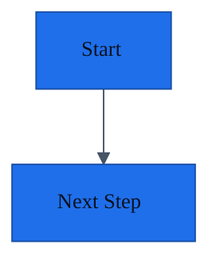

## Raw Intake README Template

Use this template for `docs/intake/README.md` when a repo needs a low-friction
place for brainstorms, planning dumps, copied chat notes, or imported project
context before those details are promoted into mapped owners.

```md
# Intake

Use this folder as a low-friction inbox for raw brainstorms, project notes,
chat exports, AI plans, sketches, or imported planning docs that have not yet
been promoted into mapped owners.

## How to Use

- Drop raw source material here when it is useful but not yet structured.
- Prefer kebab-case names for authored Markdown, but imported files can keep
  their source names.
- Do not treat raw intake as canonical project truth.
- Before building from an intake item, extract accepted facts into the relevant
  baseline, requirements, design, decision, feature, or handoff docs.
- Link important intake files from `Evidence`, `Plan Provenance`, or `Source artifacts`
  where they shaped accepted project direction.
- Record reviewed intake, unresolved questions, and stale or superseded source
  material in `../doc-health.md` when it affects future work.

## Suggested File Names

- `YYYY-MM-DD-initial-brainstorm.md`
- `YYYY-MM-DD-planning-notes.md`
- `YYYY-MM-DD-ai-plan.md`
```

## Common Metadata Block

Use this block near the top of maintained docs. See [documentation-metadata-schema.md](../documentation-metadata-schema.md) for allowed values and doc-type-specific fields.

```md
Doc type:
Owner:
Status:
Last updated:
Last verified:
Verified against:
Confidence:
Canonical source:
Related docs:
```

## Agent Instruction Snippet Template

Use this snippet in repo-level instruction files such as `AGENTS.md`, `.github/copilot-instructions.md`, `CLAUDE.md`, or similar agent entrypoints when the target repo should route agents to the canonical ownership map.

If the repo already has multiple agent entrypoints, keep them thin and align
them to the same ownership map rather than letting each file carry its
own mutable project state.

```md
## Documentation Source of Truth

This project uses Repo Memory for cross-agent continuity.

`docs/README.md` contains the Canonical Ownership Map. Update the mapped owner
for any changed capability. Do not duplicate mutable project facts in this file.

When starting or resuming work:

1. Read `docs/README.md`.
2. Run the validator (`python3 skills/repo-memory/scripts/validate-docs.py --project-docs --strict` when installed) to automatically check if documentation has drifted.
3. Follow the Canonical Ownership Map to the project overview, architecture, decision, contract, setup, and feature owners relevant to the task.
4. Review `docs/intake/` if it contains raw brainstorms, project notes, or plans relevant to the work, then promote accepted facts into the mapped owner.
5. Read `docs/feature-registry.md`; when no task is assigned, pick the first `ready` row in `Next Work Queue`.
6. Read the active `docs/features/<feature-slug>.md` before making changes.

When making changes:

- Update the active feature doc as the work changes.
- Update the `Next Work Queue` when priority, readiness, or pickup instructions change.
- Place companion plans/specs only in `docs/superpowers/plans/` or `docs/superpowers/specs/` (or `docs/designs/`).
- Update the mapped canonical owner for changed decisions, contracts, commands, architecture, runtime signals, or security posture.
- Put durable project facts in their mapped owner, not only in agent-specific instruction files or chat history.
- Keep any agent-specific instruction files short and aligned to the same docs entrypoints.

Before stopping:

- Run the validator (`python3 skills/repo-memory/scripts/validate-docs.py --project-docs --strict` when installed) and fix any warnings, errors, or plan-placement drift.
- Update `docs/features/<feature-slug>.md`, especially `Implementation Status`, `Validation`, `Resume Context`, `Next Agent Handoff`, and `Exact Next Prompt` when present.
- Update the mapped implementation-history owner for meaningful landed work.
- Update the mapped decision owner when a durable technical choice changed.
- Update `docs/doc-health.md` when docs were verified, corrected, found stale, or when duplicate ownership was removed.
```

## Deep-Dive Placement Rules

- Use `docs/requirements/user-stories-and-use-cases.md` for actors, user stories, end-to-end use cases, alternative flows, and acceptance paths in user-facing or workflow-heavy projects.
- Use `docs/intake/` for raw brainstorm dumps, copied chat notes, imported plans, sketches, and user-provided project context before accepted content is promoted into mapped owners.
- Use `docs/local-development.md` for local setup, scripts, tooling, fixtures, codegen, local services, and contributor troubleshooting.
- Use `docs/observability-and-instrumentation.md` for logs, metrics, traces, analytics events, audit events, dashboards, alerts, retention, sampling, and known blind spots.
- Use `docs/diagrams/` for maintained `.mmd`, `.drawio`, exported SVG or PNG assets, and diagram indexes.
- Use `docs/designs/` for substantial designs, proposals, rollout plans, tradeoffs, and future-evolution notes.
- Use `docs/project-details/` for domain workflows, business rules, integration quirks, deployment-specific behavior, or repo-specific conventions.
- Use `docs/components/` for shared subsystems, reusable UI components, state containers, orchestration layers, or services that span multiple features.
- Use `docs/reviews/` for substantive plan, specialist, or second-agent review records that need provenance beyond a short owning-doc note.
- Keep companion specs and plans such as `docs/superpowers/specs/...` and `docs/superpowers/plans/...` in their established workflow folder, then link them from the owning feature or design doc.
- Use `docs/ui-ux/` for user journeys, screens or surfaces, interaction states, accessibility requirements, content notes, or responsive rules.
- Use `docs/features/<feature-slug>/logic.md` for feature-local flows, state transitions, algorithms, edge cases, or event sequencing.
- Use `docs/features/<feature-slug>/components/` when the component logic only matters inside that feature and would be noise in the shared component registry.
- Keep small plan and review provenance inside the owning feature or design doc; create `docs/reviews/<review-slug>.md` only when the record is substantive, cross-cutting, or audit-worthy.
- Always link deep-dive docs from the parent feature doc, index, or relevant baseline doc.
- Do not create optional deep-dive folders until there is real content or an existing asset to index.

## Diagram Guidance

- Prefer Mermaid fenced blocks inside Markdown docs for small and medium diagrams that are easiest to review beside the prose.
- Prefer standalone `.mmd` files in `docs/diagrams/` when the diagram is large, shared, or reused across multiple docs.
- Preserve existing `.drawio` files when the team uses visual editing or when the diagram is not practical to maintain as Mermaid.
- Keep exported `.svg` or `.png` artifacts only when the repo already relies on rendered diagram assets or the Markdown target needs them.
- Link every maintained diagram from an owning doc such as `docs/architecture.md`, a design doc, a feature doc, or `docs/diagrams/README.md`.
- When Mermaid is used, prefer an explicit `init` block so the diagram remains readable even when the Markdown renderer does not provide shared theming.

## Default Mermaid Theme Snippet

````md

````

This default favors accessibility and readability: a light background, high-contrast text, restrained accent color, and readable font settings.

If the Markdown environment supports a shared theme, align Mermaid to that theme. If not, keep Mermaid self-contained with the `init` block.