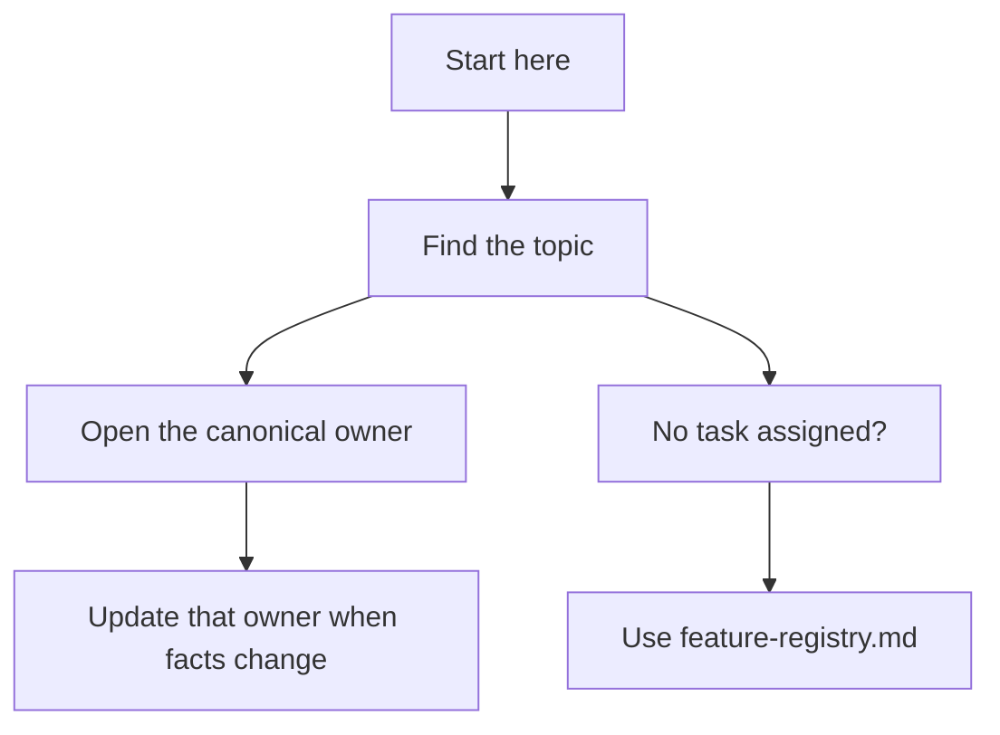

## Docs README Template

````md
# Project Docs 🧭

Welcome, future human or agent. This folder is the project map, not a mystery
novel. Use it to find the one place each kind of project truth lives.

## Start Here

1. Find the topic in the ownership map.
2. Open only the owner you need.
3. If no task was assigned, use `feature-registry.md` and pick the first
   `ready` row.
4. Before changing a feature, read its `features/<feature-slug>.md`.



## Canonical Ownership Map

One row, one owner. Supporting docs can help, but the owner is where current
truth changes.

| Capability                  | Canonical owner                               | Supporting docs                                | Notes                                                              |
| --------------------------- | --------------------------------------------- | ---------------------------------------------- | ------------------------------------------------------------------ |
| Goal, users, scope          | `project-overview.md`                         | root `README.md`                               | Product intent goes here.                                          |
| Functional requirements     | `requirements/functional-requirements.md`     | `project-overview.md`                          | Accepted behavior.                                                 |
| Non-functional requirements | `requirements/non-functional-requirements.md` | `project-overview.md`                          | Quality attributes and constraints.                                |
| Architecture                | `architecture.md`                             | `data-model.md`, `interfaces-and-contracts.md` | Replace with a stronger existing architecture owner if one exists. |
| Interfaces and contracts    | `interfaces-and-contracts.md`                 | API specs, schemas, MCP docs                   | External contracts beat prose summaries.                           |
| Local development           | `local-development.md`                        | `CONTRIBUTING.md`                              | Commands live in one place. Everyone breathes easier.              |
| Testing strategy            | `testing-strategy.md`                         | CI docs                                        | Test layers, gaps, and verification habits.                        |
| Feature state and next work | `feature-registry.md`                         | `features/`                                    | Queue, statuses, and default next task.                            |
| Active handoff              | `features/<feature-slug>.md`                  | `feature-registry.md`                          | Resume context, validation, and next safe step.                    |
| Doc health                  | `doc-health.md`                               | this file                                      | Stale docs, conflicts, verification gaps.                          |
| Raw ideas and evidence      | `intake/README.md`                            | intake files                                   | Brain dumps live here until accepted facts graduate. 🎓            |

## Handy Links

- 🧠 Product intent: [project-overview.md](./project-overview.md)
- 🧱 Architecture: [architecture.md](./architecture.md)
- ✅ Requirements: [requirements/](./requirements/)
- 🧪 Tests: [testing-strategy.md](./testing-strategy.md)
- 🚦 Next work: [feature-registry.md](./feature-registry.md)
- 🩺 Doc health: [doc-health.md](./doc-health.md)
- 📥 Raw intake: [intake/README.md](./intake/README.md)

## Tiny Rules

- Keep facts in their owner, not sprinkled everywhere.
- Link to strong existing docs instead of copying them.
- Mark unknowns as unknown. Guessing wears a fake mustache.
- When reality changes, update the owner and `doc-health.md`.
````
